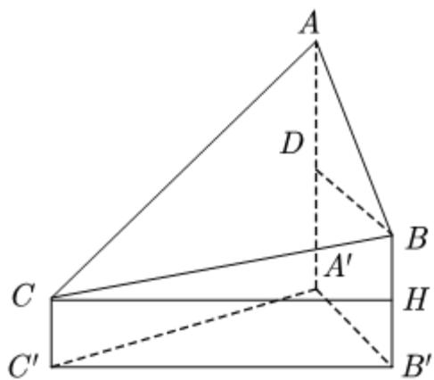

> [!faq]- 2021年全国高考甲卷数学（理）试题（解析版）A3解析
>
> > [!success]- **【答案】** B
>
> > [!note]- **【分析】**
> > 通过做辅助线，将已知所求量转化到一个三角形中，借助正弦定理，求得 $A'B'$ ，进而得到答案.
>
> > [!note]- **【解析】**
> > 
> >
> > 过 $C$ 作 $CH \perp BB'$ ，过 $B$ 作 $BD \perp AA'$ ，
> >
> > 故 $AA'-CC'=AA'-(BB'-BH)=AA'-BB'+100=AD+100$
> >
> > 由题，易知 $\triangle ADB$ 为等腰直角三角形，所以 $AD = DB$ 。
> >
> > 所以 $AA'-CC'=DB+100=A'B'+100$
> >
> > 因为 $\angle BCH = 15^{\circ}$ ，所以 $CH = C'B' = \frac{100}{\tan 15^{\circ}}$
> >
> > 在 $\triangle A'B'C'$ 中，由正弦定理得：
> >
> > $$
> > \frac {A ^ {\prime} B ^ {\prime}}{\sin 4 5 ^ {\circ}} = \frac {C ^ {\prime} B ^ {\prime}}{\sin 7 5 ^ {\circ}} = \frac {1 0 0}{\tan 1 5 ^ {\circ} \cos 1 5 ^ {\circ}} = \frac {1 0 0}{\sin 1 5 ^ {\circ}},
> > $$
> >
> > 而 $\sin 15^{\circ} = \sin (45^{\circ} - 30^{\circ}) = \sin 45^{\circ}\cos 30^{\circ} - \cos 45^{\circ}\sin 30^{\circ} = \frac{\sqrt{6} - \sqrt{2}}{4},$
> >
> > 所以 $A'B' = \frac{100\times 4\times\frac{\sqrt{2}}{2}}{\sqrt{6} - \sqrt{2}} = 100(\sqrt{3} +1)\approx 273$
> >
> > 所以 $AA'-CC'=A'B'+100\approx373$
> >
> > 故选：B.
> >
> > 【点睛】本题关键点在于如何正确将 $AA'-CC'$ 的长度通过作辅助线的方式转化为 $A'B'+100$ .
