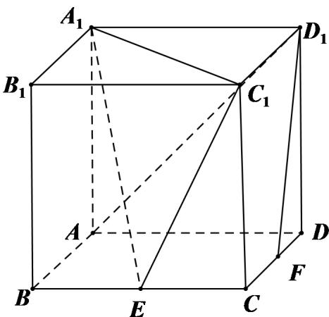

<!-- question-source:start -->
17. 如图, 在棱长为 2 的正方体 $ABCD - A_{1}B_{1}C_{1}D_{1}$ 中, $E$ 为棱 $BC$ 的中点, $F$ 为棱 $CD$ 的中点.

(I) 求证: $D_{1}F \parallel$ 平面 $A_{1}EC_{1}$ ;

(II) 求直线 $AC_{1}$ 与平面 $A_{1}EC_{1}$ 所成角 正弦值.

(III) 求二面角 $A - A_{1}C_{1} - E$ 的正弦值.

【
<!-- question-source:end -->

![[高中/真题/按年份分类/2021/2021年天津市高考数学试卷_解析版_/解答题/题目/answers/Q00025572A1.md]]
