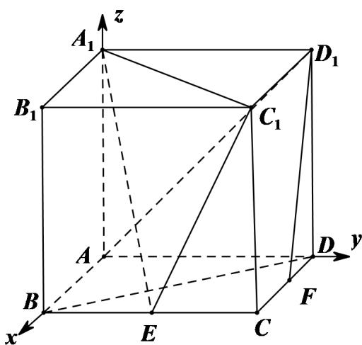

> [!faq]- 2021年天津市高考数学试卷（解析版）解析
>
> > [!success]- **【答案】** （I）证明见
>
> > [!note]- **【分析】**
> > (I) 建立空间直角坐标系, 求出 $D_{1}F$ 及平面 $A_{1}EC_{1}$ 的一个法向量 m, 证明 $D_{1}F \perp m$ , 即可得证;
>
> > [!note]- **【解析】**
> > （I）以 $^{A}$ 为原点， $^{AB,AD,AA_{1}}$ 分别为 $^{x,y,z}$ 轴，建立如图空间直角坐标系，则 $A(0,0,0),A_{1}(0,0,2),B(2,0,0),C(2,2,0),D(0,2,0),C_{1}(2,2,2),D_{1}(0,2,2)$ ，
> >
> > 因为 E 为棱 BC 的中点，F 为棱 CD 的中点，所以 $E(2,1,0)$ ， $F(1,2,0)$ ，
> >
> > 所以 $D_{1}F=(1,0,-2)$ , $A_{1}C_{1}=(2,2,0)$ , $A_{1}E=(2,1,-2)$ ,
> >
> > 设平面 $A_{1}EC_{1}$ 的一个法向量为 $m=(x_{1},y_{1},z_{1})$ ,
> >
> > 则 $\left\{\begin{aligned}m\cdot A_{1}C_{1}&=2x_{1}+2y_{1}=0\\ m\cdot A_{1}E&=2x_{1}+y_{1}-2z_{1}=0\end{aligned}\right.$ ，令 $x_{1}=2$ ，则 $m=(2,-2,1)$ ，
> >
> > 因为 $D_{1}F \cdot m = 2 - 2 = 0$ ，所以 $D_{1}F \perp m$ ，
> >
> > 因为 $D_{1}F \not\subset$ 平面 $A_{1}EC_{1}$ ，所以 $D_{1}F //$ 平面 $A_{1}EC_{1}$ ;
> >
> > (II) 由 (1) 得, $AC_{1} = (2,2,2)$ ,
> >
> > 设直线 $AC_{1}$ 与平面 $A_{1}EC_{1}$ 所成角为 $\theta$
> >
> > $$
> > \sin \theta = \left| \cos \left\langle m, A C _ {1} \right\rangle \right| = \left| \frac {\vec {m} \cdot A C}{\left| m \right| \cdot \left| A C _ {1} \right|} \right| = \frac {2}{3 \times 2 \sqrt {3}} = \frac {\sqrt {3}}{9};
> > $$
> >
> > (III) 由正方体的特征可得，平面 $AA_{1}C_{1}$ 的一个法向量为 $DB = (2, -2, 0)$ ，
> >
> > 则 $\cos\left\langle DB,m\right\rangle=\frac{DB\cdot m}{\left|DB\right|\cdot\left|m\right|}=\frac{8}{3\times2\sqrt{2}}=\frac{2\sqrt{2}}{3}$
> >
> > 所以二面角 $A - A_{1}C_{1} - E$ 的正弦值为 $\sqrt{1 - \cos^{2}\left\langle DB, m \right\rangle} = \frac{1}{3}$ .
> >
> > 
