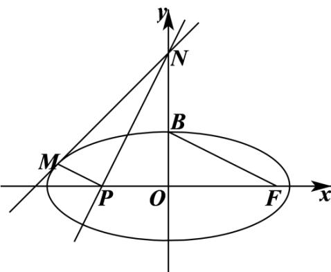

> [!faq]- 2021年天津市高考数学试卷（解析版）解析
>
> > [!success]- **【答案】** （1） $\frac{x^{2}}{5}+y^{2}=1$ ；（2） $x-y+\sqrt{6}=0$ 【
>
> > [!note]- **【分析】**
> > （1）求出 $a$ 的值，结合 $c$ 的值可得出 $b$ 的值，进而可得出椭圆的方程；
>
> > [!note]- **【解析】**
> > （1）易知点 $F(c,0)$ 、 $B(0,b)$ ，故 $\left|BF\right| = \sqrt{c^2 + b^2} = a = \sqrt{5}$
> >
> > 因为椭圆的离心率为 $e = \frac{c}{a} = \frac{2\sqrt{5}}{5}$ ，故 $c = 2$ ， $b = \sqrt{a^2 - c^2} = 1$
> >
> > 因此，椭圆的方程为 $\frac{x^{2}}{5}+y^{2}=1$ ;
> >
> > (2) 设点 $M(x_{0}, y_{0})$ 为椭圆 $\frac{x^{2}}{5} + y^{2} = 1$ 上一点，
> >
> > 先证明直线 $MN$ 的方程为 $\frac{x_0x}{5} + y_0y = 1$
> >
> > 联立 $\left\{ \begin{array}{l} \frac{x_0x}{5} + y_0y = 1 \\ \frac{x^2}{5} + y^2 = 1 \end{array} \right.$ ，消去 并整理得 $x^2 - 2x_0x + x_0^2 = 0$ ， $\Delta = 4x_0^2 - 4x_0^2 = 0$
> >
> > 因此，椭圆 $\frac{x^2}{5} + y^2 = 1$ 在点 $M(x_0, y_0)$ 处的切线方程为 $\frac{x_0x}{5} + y_0y = 1$ .
> >
> > 
> >
> > 在直线 $MN$ 的方程中，令 $_{x} = 0$ ，可得 $y = \frac{1}{y_0}$ ，由题意可知 $y_0 > 0$ ，即点 $N\left(0, \frac{1}{y_0}\right)$ ，
> >
> > 直线 $BF$ 的斜率为 $k_{BF} = -\frac{b}{c} = -\frac{1}{2}$ ，所以，直线 $PN$ 的方程为 $y = 2x + \frac{1}{y_0}$ ，
> >
> > 在直线 $PN$ 方程中，令 $y = 0$ ，可得 $x = -\frac{1}{2y_0}$ ，即点 $P\left(-\frac{1}{2y_0},0\right)$
> >
> > 因为 $_{MP//BF}$ ，则 $k_{MP}=k_{BF}$ ，即 $\frac{y_{0}}{x_{0}+\frac{1}{2y_{0}}}=\frac{2y_{0}^{2}}{2x_{0}y_{0}+1}=-\frac{1}{2}$ ，整理可得 $(x_{0}+5y_{0})^{2}=0$ ，
> >
> > 所以， $x_0 = -5y_0$ ，因为 $\frac{x_0^2}{5} +y_0^2 = 6y_0^2 = 1$ ， $\therefore y_0 > 0$ ，故 $y_{0} = \frac{\sqrt{6}}{6}$ ， $x_0 = -\frac{5\sqrt{6}}{6}$
> >
> > 所以，直线 $l$ 的方程为 $-\frac{\sqrt{6}}{6} x + \frac{\sqrt{6}}{6} y = 1$ ，即 $x - y + \sqrt{6} = 0$
> >
> > 【点睛】结论点睛：在利用椭圆的切线方程时，一般利用以下方法进行直线：
> >
> > (1) 设切线方程为 $y = kx + m$ 与椭圆方程联立，由 $\Delta = 0$ 进行求解；
> >
> > (2)椭圆 $\frac{x^2}{a^2} +\frac{y^2}{b^2} = 1$ 在其上一点 $(x_0,y_0)$ 的切线方程为 $\frac{x_0x}{a^2} +\frac{y_0y}{b^2} = 1$ ，再应用此方程时，首
> >
> > 先应证明直线 $\frac{x_0x}{a^2} +\frac{y_0y}{b^2} = 1$ 与椭圆 $\frac{x^2}{a^2} +\frac{y^2}{b^2} = 1$ 相切.
