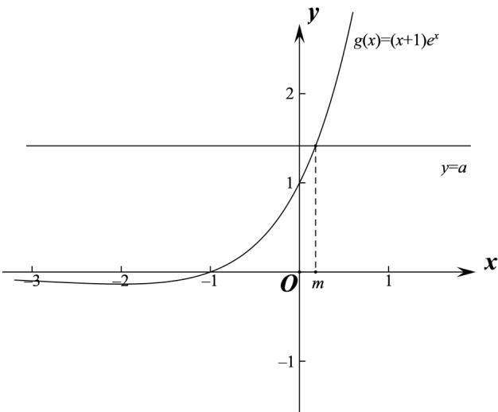

> [!faq]- 2021年天津市高考数学试卷（解析版）解析
>
> > [!success]- **【答案】** (I) $y=(a-1)x,(a>0)$ ; (II) 证明见
>
> > [!note]- **【分析】**
> > (I) 求出 $f(x)$ 在 x=0 处的导数，即切线斜率，求出 $f
> > (0)$ ，即可求出切线方程；
>
> > [!note]- **【解析】**
> > (I) $f'(x)=a-(x+1)e^{x}$ ，则 $f'(0)=a-1$ ，
> >
> > 又 $f(0) = 0$ ，则切线方程为 $y = (a - 1)x,(a > 0)$
> >
> > (II) 令 $f'(x) = a - (x + 1)e^x = 0$ ，则 $a = (x + 1)e^x$ ，
> >
> > 令 $g(x) = (x + 1)e^{x}$ ，则 $g'(x) = (x + 2)e^x$
> >
> > 当 $x \in (-\infty, -2)$ 时， $g'(x) < 0$ ， $g(x)$ 单调递减；当 $x \in (-2, +\infty)$ 时， $g'(x) > 0$ ， $g(x)$ 单调递增，
> >
> > 当 $x \to -\infty$ 时， $g(x) < 0$ ， $g(-1) = 0$ ，当 $x \to +\infty$ 时， $g(x) > 0$ ，画出 $g(x)$ 大致图像如下：
> >
> > 
> >
> > 所以当 $a > 0$ 时， $y = a$ 与 $y = g(x)$ 仅有一个交点，令 $g(m) = a$ ，则 $m > -1$ ，且 $f'(m) = a - g(m) = 0$ ，
> >
> > 当 $x\in (-\infty ,m)$ 时， $a > g(x)$ ，则 $f^{\prime}(x) > 0$ ， $f(x)$ 单调递增，
> >
> > 当 $x \in (m, +\infty)$ 时， $a < g(x)$ ，则 $f'(x) < 0$ ， $f(x)$ 单调递减，
> >
> > $x = m$ 为 $f(x)$ 的极大值点，故 $f(x)$ 存在唯一的极值点；
> >
> > (III) 由 (II) 知 $f(x)_{\max} = f(m)$ ，此时 $a = (1 + m)e^m, m > -1$ ，
> >
> > 所以 $\{f(x)-a\}_{\max}=f(m)-a=\left(m^{2}-m-1\right)e^{m},(m>-1)$
> >
> > 令 $h(x) = (x^2 - x - 1)e^x, (x > -1)$ ,
> >
> > 若存在 a，使得 $f(x) \leq a + b$ 对任意 $x \in R$ 成立，等价于存在 $x \in (-1, +\infty)$ ，使得 $h(x) \leq b$ ，即 $b \geq h(x)_{\min}$ ,
> >
> > $$
> > h ^ {\prime} (x) = \left(x ^ {2} + x - 2\right) e ^ {x} = (x - 1) (x + 2) e ^ {x}, x > - 1,
> > $$
> >
> > 当 $x \in (-1,1)$ 时， $h'(x) < 0$ ， $h(x)$ 单调递减，当 $x \in (1, +\infty)$ 时， $h'(x) > 0$ ， $h(x)$ 单调递增，
> > 所以 $h(x)_{\min}=h(1)=-e$ ，故 $b\geq-e$ ，
> >
> > 所以实数 b 的取值范围 $\left[-e,+\infty\right)$ .
> >
> > 【点睛】关键点睛：第二问解题的关键是转化为证明 $y = a$ 与 $y = g(x)$ 仅有一个交点；第三
> >
> > 问解题的关键是转化为存在 $x \in (-1, +\infty)$ ，使得 $h(x) \leq b$ ，即 $b \geq h(x)_{\min}$ .
