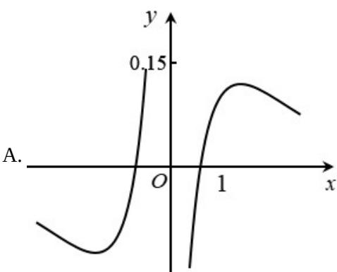
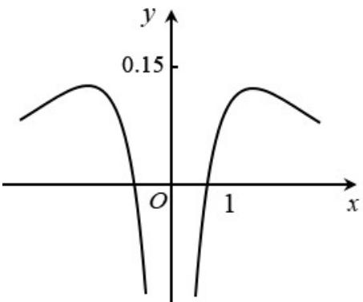
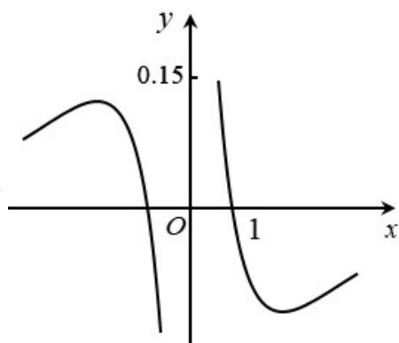
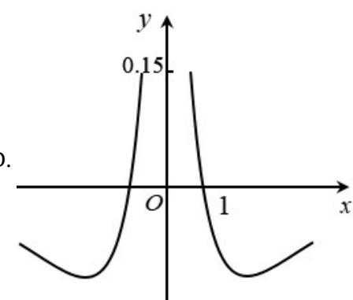

<!-- question-source:start -->
3. 函数 $y = \frac{\ln |x|}{x^{2} + 2}$ 的图像大致为（）

  
B.

C.  

D.  

【
<!-- question-source:end -->

![[高中/真题/按年份分类/2021/2021年天津市高考数学试卷_解析版_/选择题/题目/answers/Q00025558A1.md]]
