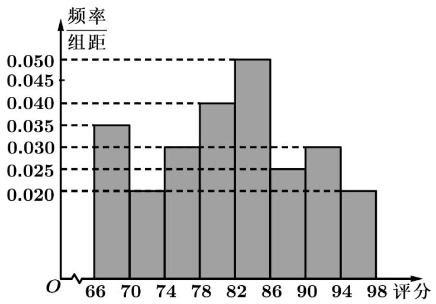

<!-- question-source:start -->
4. 从某网络平台推荐的影视作品中抽取 400 部, 统计其评分分数据, 将所得 400 个评分

数据分为8组： $\left[66,70\right)$ 、 $\left[70,74\right)$ 、…、 $\left[94,98\right]$ ，并整理得到如下的费率分布直方图，

则评分在区间 $\left[82,86\right)$ 内的影视作品数量是（）

A. $^{20}$ B. $^{40}$ C. $^{64}$ D. $^{80}$

【
<!-- question-source:end -->

![[高中/真题/按年份分类/2021/2021年天津市高考数学试卷_解析版_/选择题/题目/answers/Q00025559A1.md]]
