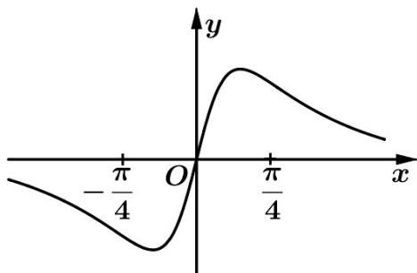

<!-- question-source:start -->
7. 已知函数 $f(x) = x^2 + \frac{1}{4}, g(x) = \sin x$ ，则图象为如图的函数可能是（）

A. $y = f(x) + g(x) - \frac{1}{4}$ B. $y = f(x) - g(x) - \frac{1}{4}$

C. $y = f(x)g(x)$ D. $y = \frac{g(x)}{f(x)}$
<!-- question-source:end -->

![[高中/真题/按年份分类/2021/2021年浙江省高考数学试题_解析版_/一_选择题/题目/answers/Q00021052A1.md]]
