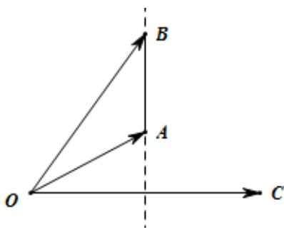

> [!faq]- 2021年浙江省高考数学试题（解析版）解析
>
> > [!success]- **【答案】** B
>
> > [!note]- **【分析】**
> > 考虑两者之间的推出关系后可得两者之间的条件关系.
>
> > [!note]- **【解析】**
> > 如图所示， $OA = a, OB = b, OC = c, BA = a - b$ ，当 $AB \perp OC$ 时， $a - b$ 与 $c$ 垂直， $\left(\vec{a} -\vec{b}\right)\cdot \vec{c} = 0$ ，所以 $\vec{a}\cdot \vec{c} = \vec{b}\cdot \vec{c}$ 成立，此时 $a\neq b$ ， $\therefore \vec{a}\cdot \vec{c} = \vec{b}\cdot \vec{c}$ 不是 $a = b$ 的充分条件，
> > 当 $a = b$ 时， $a - b = 0$ ， $\therefore \left( \begin{array}{l}1\\ a - b \end{array} \right)\cdot c = 0\cdot c = 0,\therefore \vec{a}\cdot \vec{c} = \vec{b}\cdot \vec{c}$ 成立， $\therefore \vec{a}\cdot \vec{c} = \vec{b}\cdot \vec{c}$ 是 $a = b$ 的必要条件，  
> > 综上，“ $\vec{a}\cdot \vec{c} = \vec{b}\cdot \vec{c}$ ”是“ $\vec{a} = \vec{b}$ ”的必要不充分条件
> >
> > 
> >
> > 故选：B.
