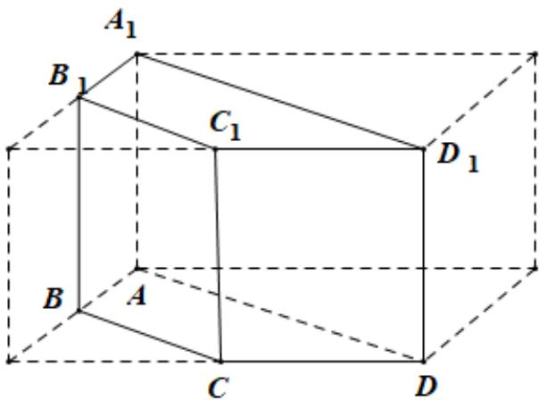

> [!faq]- 2021年浙江省高考数学试题（解析版）解析
>
> > [!success]- **【答案】** A
>
> > [!note]- **【分析】**
> > 根据三视图可得如图所示的几何体，根据棱柱的体积公式可求其体积.
>
> > [!note]- **【解析】**
> > 几何体为如图所示的四棱柱 $ABCD - A_{1}B_{1}C_{1}D_{1}$ ，其高为1，底面为等腰梯形 $ABCD$ ，该等腰梯形的上底为 $\sqrt{2}$ ，下底为 $2\sqrt{2}$ ，腰长为1，故梯形的高为 $\sqrt{1 - \frac{1}{2}} = \frac{\sqrt{2}}{2}$ 故 $V_{ABCD - A_1B_1C_1D_1} = \frac{1}{2}\times (\sqrt{2} +2\sqrt{2})\times \frac{\sqrt{2}}{2}\times 1 = \frac{3}{2},$
> >
> > 故选：A.
> >
> > 
