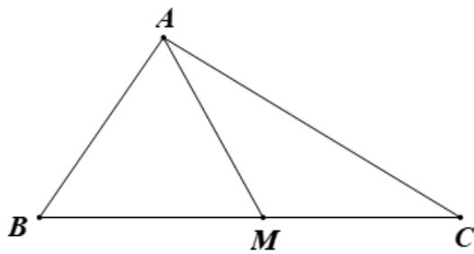

> [!faq]- 2021年浙江省高考数学试题（解析版）解析
>
> > [!success]- **【答案】** (1). $2\sqrt{13}$ (2). $\frac{2\sqrt{39}}{13}$
>
> > [!note]- **【分析】**
> > 由题意结合余弦定理可得 BC=8，进而可得 AC，再由余弦定理可得 $\cos\angle MAC$ .
>
> > [!note]- **【解析】**
> > 由题意作出图形，如图，
> >
> > 
> >
> > 在 $\triangle ABM$ 中，由余弦定理得 $AM^2 = AB^2 + BM^2 - 2BM \cdot BA \cdot \cos B$
> >
> > 即 $12 = 4 + BM^{2} - 2BM \times 2 \times \frac{1}{2}$ ，解得 BM = 4 （负值舍去），
> >
> > 所以 BC=2BM=2CM=8，
> >
> > 在 $\triangle ABC$ 中，由余弦定理得 $AC^{2} = AB^{2} + BC^{2} - 2AB\cdot BC\cdot \cos B = 4 + 64 - 2\times 2\times 8\times \frac{1}{2} = 52$
> >
> > 所以 $AC = 2\sqrt{13}$ ;
> >
> > 在 $\triangle AMC$ 中，由余弦定理得 $\cos \angle MAC = \frac{AC^2 + AM^2 - MC^2}{2AM\cdot AC} = \frac{52 + 12 - 16}{2\times 2\sqrt{3}\times 2\sqrt{13}} = \frac{2\sqrt{39}}{13}$
> >
> > 故答案为： $2\sqrt{13}$ ; $\frac{2\sqrt{39}}{13}$ .
