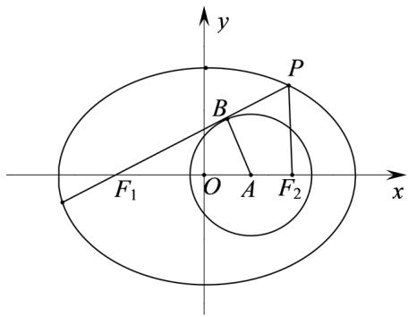

> [!faq]- 2021年浙江省高考数学试题（解析版）解析
>
> > [!success]- **【答案】** (1). $\frac{2\sqrt{5}}{5}$ (2). $\frac{\sqrt{5}}{5}$
>
> > [!note]- **【分析】**
> > 不妨假设 $c = 2$ ，根据图形可知， $\sin \angle PF_{1}F_{2} = \frac{2}{3}$ ，再根据同角三角函数基本关系即可求出
>
> > [!note]- **【解析】**
> > 
> >
> > 如图所示：不妨假设 c=2，设切点为 B，
> >
> > $$
> > \sin \angle P F _ {1} F _ {2} = \sin \angle B F _ {1} A = \frac {| A B |}{| F _ {1} A |} = \frac {2}{3}, \tan \angle P F _ {1} F _ {2} = \frac {2}{\sqrt {3 ^ {2} - 2 ^ {2}}} = \frac {2}{5} \sqrt {5}
> > $$
> >
> > 所以 $k=\frac{2\sqrt{5}}{5}$ ，由 $k=\frac{\left|PF_{2}\right|}{\left|F_{1}F_{2}\right|},\left|F_{1}F_{2}\right|=2c=4$ ，所以 $\left|PF_{2}\right|=\frac{8\sqrt{5}}{5}$ ， $\left|PF_{1}\right|=\left|PF_{2}\right|\times\frac{1}{\sin\angle PF_{1}F_{2}}=\frac{12\sqrt{5}}{5}$ ，
> >
> > 于是 $2a = \left|PF_{1}\right| + \left|PF_{2}\right| = 4\sqrt{5}$ ，即 $a = 2\sqrt{5}$ ，所以 $e = \frac{c}{a} = \frac{2}{2\sqrt{5}} = \frac{\sqrt{5}}{5}$ .
> >
> > 故答案为： $\frac{2\sqrt{5}}{5}$ ; $\frac{\sqrt{5}}{5}$ .
