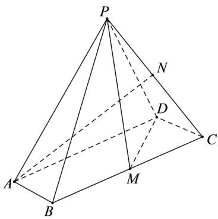

<!-- question-source:start -->
19. 如图, 在四棱锥 $P - ABCD$ 中, 底面 $ABCD$ 是平行四边形, $\angle ABC = 120^{\circ}, AB = 1, BC = 4, PA = \sqrt{15}$ ,

M, N 分别为 $BC, PC$ 的中点， $PD \perp DC, PM \perp MD$ .

(1) 证明: $AB \perp PM$ ;

(2) 求直线 AN 与平面 PDM 所成角的正弦值.
<!-- question-source:end -->

![[高中/真题/按年份分类/2021/2021年浙江省高考数学试题_解析版_/解答题/题目/answers/Q00021064A1.md]]
