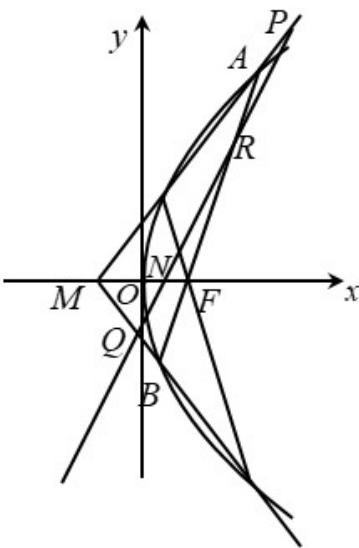

<!-- question-source:start -->
21. 如图，已知 $F$ 是抛物线 $y^{2} = 2px(p > 0)$ 的焦点， $M$ 是抛物线的准线与 $x$ 轴的交点，且 $\left|MF\right| = 2$

(1) 求抛物线的方程;

(2) 设过点 $F$ 的直线交抛物线与 $A, B$ 两点，斜率为 2 的直线 $l$ 与直线 $MA, MB, AB$ ， $x$ 轴依次交于点

$P, Q, R, N$ ，且 $\left|RN\right|^2 = \left|PN\right| \cdot \left|QN\right|$ ，求直线 $l$ 在 $x$ 轴上截距的范围.

【
<!-- question-source:end -->

![[高中/真题/按年份分类/2021/2021年浙江省高考数学试题_解析版_/解答题/题目/answers/Q00022459A1.md]]
