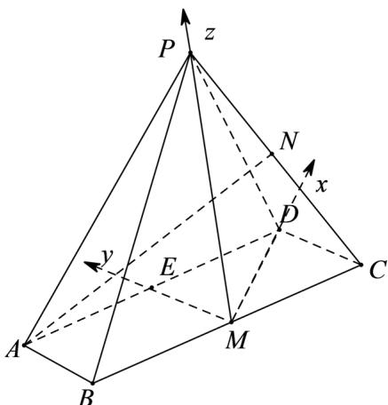

> [!faq]- 2021年浙江省高考数学试题（解析版）解析
>
> > [!success]- **【答案】** （1）证明见
>
> > [!note]- **【分析】**
> > (1) 要证 $AB \perp PM$ ，可证 $DC \perp PM$ ，由题意可得， $PD \perp DC$ ，易证 $DM \perp DC$ ，从而 $DC \perp$ 平
>
> > [!note]- **【解析】**
> > （1）在 $\triangle DCM$ 中， $DC = 1$ ， $CM = 2$ ， $\angle DCM = 60^{\circ}$ ，由余弦定理可得 $DM = \sqrt{3}$
> >
> > 所以 $DM^{2} + DC^{2} = CM^{2}$ ，∴ $DM \perp DC$ ．由题意 $DC \perp PD$ 且 $PD \cap DM = D$ ，∴ $DC \perp$ 平面 PDM，而
> >
> > $PM \subset$ 平面 $PDM$ ，所以 $DC \perp PM$ ，又 $AB // DC$ ，所以 $AB \perp PM$ 。
> > (2) 由 $PM \perp MD$ ， $AB \perp PM$ ，而 $AB$ 与 $DM$ 相交，所以 $PM \perp$ 平面 $ABCD$ ，因为 $AM = \sqrt{7}$ ，所以
> >
> > $PM = 2\sqrt{2}$ ，取 $AD$ 中点 $E$ ，连接 $ME$ ，则 $ME,DM,PM$ 两两垂直，以点 $M$ 为坐标原点，如图所示，建立空间直角坐标系，
> >
> > 则 $A(-\sqrt{3},2,0),P(0,0,2\sqrt{2}),D(\sqrt{3},0,0),M(0,0,0),C(\sqrt{3},-1,0)$
> >
> > 又 $N$ 为 $PC$ 中点，所以 $N\left(\frac{\sqrt{3}}{2}, - \frac{1}{2},\sqrt{2}\right)^{\rightarrow},AN = \left(\frac{3\sqrt{3}}{2}, - \frac{5}{2},\sqrt{2}\right)$ .
> >
> > 由
> > （1）得 $CD \perp$ 平面 $PDM$ ，所以平面 $PDM$ 的一个法向量 $n = (0,1,0)$
> >
> > 从而直线 与平面 所成角的正弦值为 $\sin \theta = \frac{\overrightarrow{|AN} \cdot \overrightarrow{n}|}{|AN| |n|} = \frac{\frac{5}{2}}{\sqrt{\frac{27}{4} + \frac{25}{4} + 2}} = \frac{\sqrt{15}}{6}$ .
> >
> > 
> >
> > 【点睛】本题第一问主要考查线面垂直的相互转化，要证明 $AB \perp PM$ ，可以考虑 $DC \perp PM$
> >
> > 题中与 $DC$ 有垂直关系的直线较多, 易证 $DC \perp$ 平面 $PDM$ , 从而使问题得以解决; 第二问思路直接, 由第一问的垂直关系可以建立空间直角坐标系, 根据线面角的向量公式即可计算得出.
