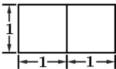
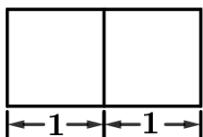
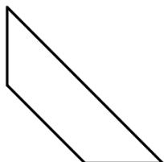

<!-- question-source:start -->
4. 某几何体的三视图如图所示，则该几何体的体积是（）

  
正视图

  
侧视图

  
俯视图

A. $\frac{3}{2}$ B. 3 C. $\frac{3\sqrt{2}}{2}$ D. $3\sqrt{2}$

【
<!-- question-source:end -->

![[高中/真题/按年份分类/2021/2021年浙江省高考数学试题_解析版_/选择题/题目/answers/Q00022442A1.md]]
