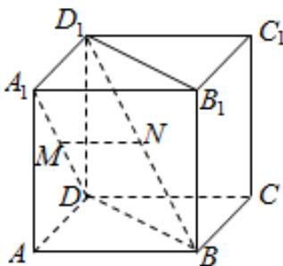

<!-- question-source:start -->
6. 如图已知正方体 $ABCD - A_{1}B_{1}C_{1}D_{1}$ ， $M$ ， $N$ 分别是 $A_{1}D$ ， $D_{1}B$ 的中点，则（）

A. 直线 $A_{1}D$ 与直线 $D_{1}B$ 垂直，直线 $MN \parallel$ 平面 $ABCD$

B. 直线 $A_{1}D$ 与直线 $D_{1}B$ 平行，直线 $MN \perp$ 平面 $BDD_{1}B_{1}$

C. 直线 $A_{1}D$ 与直线 $D_{1}B$ 相交，直线 $MN \parallel$ 平面 $ABCD$

D. 直线 $A_{1}D$ 与直线 $D_{1}B$ 异面，直线 $MN \perp$ 平面 $BDD_{1}B_{1}$

【
<!-- question-source:end -->

![[高中/真题/按年份分类/2021/2021年浙江省高考数学试题_解析版_/选择题/题目/answers/Q00022444A1.md]]
