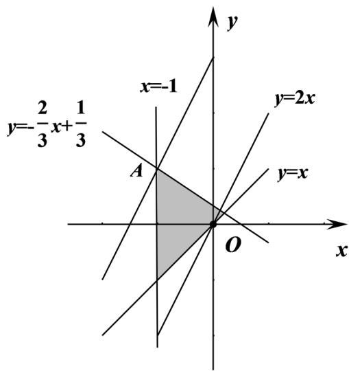

> [!faq]- 2021年浙江省高考数学试题（解析版）解析
>
> > [!success]- **【答案】** B
>
> > [!note]- **【分析】**
> > 画出满足条件的可行域, 目标函数化为 $y = 2x - 2z$ , 求出过可行域点, 且斜率为 $^{2}$ 的直线在 y 轴上截距的最大值即可.
>
> > [!note]- **【解析】**
> > 画出满足约束条件 $\left\{\begin{aligned}x+1&\geq0\\ x-y&\leq0\\ 2x+3y-1&\leq0\end{aligned}\right.$ 的可行域，
> >
> > 如下图所示:
> >
> > 
> >
> > 目标函数 $z = x - \frac{1}{2} y$ 化为 $y = 2x - 2z$ ,
> >
> > 由 $\left\{ \begin{array}{l}x = -1\\ 2x + 3y - 1 = 0, \end{array} \right.$ 解得 $\left\{ \begin{array}{l}x = -1\\ y = 1 \end{array} \right.$ ，设 $A(-1,1)$
> >
> > 当直线 $y = 2x - 2z$ 过 $\mathrm{A}$ 点时，
> >
> > $z = x - \frac{1}{2} y$ 取得最小值为 $-\frac{3}{2}$ .
> >
> > 故选：B
