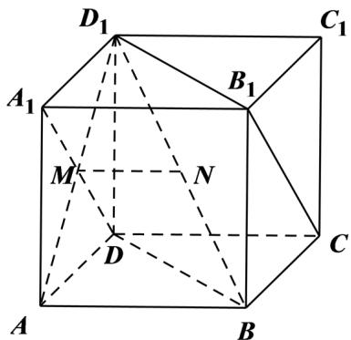

> [!faq]- 2021年浙江省高考数学试题（解析版）解析
>
> > [!success]- **【答案】** A
>
> > [!note]- **【分析】**
> > 由正方体间的垂直、平行关系，可证 $MN//AB, A_1D \perp$ 平面 $ABD_1$ ，即可得出结论.
>
> > [!note]- **【解析】**
> > 
> >
> > 连 $AD_{1}$ ，在正方体 $ABCD - A_{1}B_{1}C_{1}D_{1}$ 中，
> >
> > $M$ 是 $A_{1}D$ 的中点，所以 $M$ 为 $AD_{1}$ 中点，
> >
> > 又 N 是 $D_{1}B$ 的中点，所以 MN // AB，
> >
> > $$
> > M N \notin_ {\text {平面}} A B C D, A B \subset_ {\text {平面}} A B C D,
> > $$
> >
> > 所以 $MN / /$ 平面ABCD.
> >
> > 因为 $AB$ 不垂直 $BD$ ，所以 $MN$ 不垂直 $BD$
> >
> > 则 $MN$ 不垂直平面 $BDD_{1}B_{1}$ ，所以选项B,D不正确；
> >
> > 在正方体 $ABCD - A_{1}B_{1}C_{1}D_{1}$ 中， $AD_{1} \perp A_{1}D$ ，
> >
> > $AB \perp$ 平面 $AA_{1}D_{1}D$ ，所以 $AB \perp A_{1}D$ ，
> >
> > $AD_{1} \cap AB = A$ ，所以 $A_{1}D \perp$ 平面 $ABD_{1}$ ，
> >
> > $D_{1}B \subset$ 平面 $ABD_{1}$ ，所以 $A_{1}D \perp D_{1}B$ ，
> >
> > 且直线 $A_{1}D, D_{1}B$ 是异面直线，
> >
> > 所以选项 C 错误，选项 A 正确.
> >
> > 故选：A.
> >
> > 【点睛】关键点点睛：熟练掌握正方体中的垂直、平行关系是解题的关键，如两条棱平行或垂直，同一个面对角线互相垂直，正方体的对角线与面的对角线是相交但不垂直或异面垂直关系.
