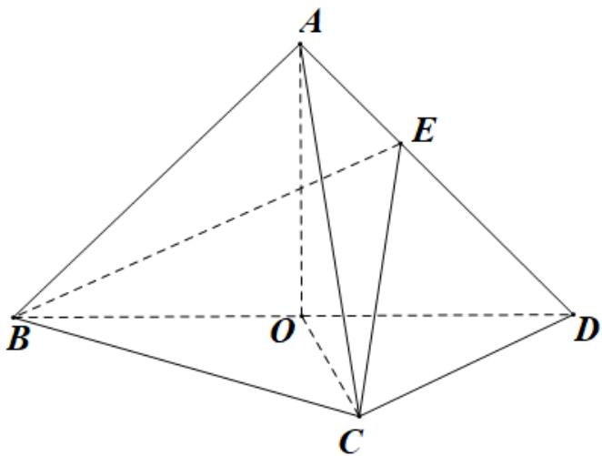

<!-- question-source:start -->
20. 如图, 在三棱锥 $A - BCD$ 中, 平面 $ABD \perp$ 平面 $BCD$ , $AB = AD$ , $O$ 为 $BD$ 的中点.

<!-- question-source:end -->

![[高中/真题/按年份分类/2021/2021年高考新高考1卷数学高考真题_解析版_/解答题/题目/answers/Q00027630A1.md]]
