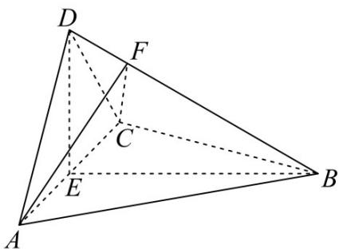

<!-- question-source:start -->
18. 如图，四面体 ABCD 中， $AD \perp CD, AD = CD, \angle ADB = \angle BDC$ ，E 为 AC 的中点.

<!-- question-source:end -->

![[高中/真题/按年份分类/2022/2022年全国乙卷文科/解答题/题目/answers/Q00027634A1.md]]
