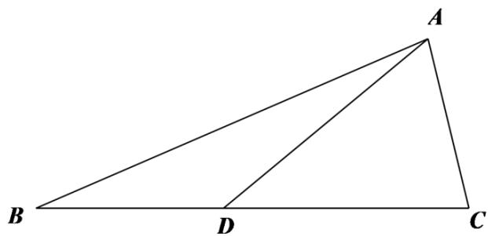

> [!faq]- 2022年高考全国甲卷数学（文）真题（解析版）解析
>
> > [!success]- **【答案】** $\sqrt{3} - 1_{\# \#} - 1 + \sqrt{3}$
>
> > [!note]- **【分析】**
> > 设 $CD = 2BD = 2m > 0$ ，利用余弦定理表示出 $\frac{AC^2}{AB^2}$ 后，结合基本不等式即可得解.
>
> > [!note]- **【解析】**
> > 详解】设 $CD = 2BD = 2m > 0$
> >
> > 则 $\triangle ABD$ 中， $AB^{2} = BD^{2} + AD^{2} - 2BD\cdot AD\cos \angle ADB = m^{2} + 4 + 2m$
> >
> > 在 $\triangle ACD$ 中， $AC^2 = CD^2 +AD^2 -2CD\cdot AD\cos \angle ADC = 4m^2 +4 - 4m$
> >
> > $$
> > \frac {A C ^ {2}}{A B ^ {2}} = \frac {4 m ^ {2} + 4 - 4 m}{m ^ {2} + 4 + 2 m} = \frac {4 (m ^ {2} + 4 + 2 m) - 1 2 (1 + m)}{m ^ {2} + 4 + 2 m} = 4 - \frac {1 2}{(m + 1) + \frac {3}{m + 1}}
> > $$
> >
> > $$
> > \geq 4 - \frac {1 2}{2 \sqrt {(m + 1) \cdot \frac {3}{m + 1}}} = 4 - 2 \sqrt {3},
> > $$
> >
> > 当且仅当 $m + 1 = \frac{3}{m + 1}$ 即 $m = \sqrt{3} - 1$ 时，等号成立，
> >
> > 所以当 $\frac{AC}{AB}$ 取最小值时， $m=\sqrt{3}-1$ .
> >
> > 故答案为： $\sqrt{3} - 1$
> >
> > 
