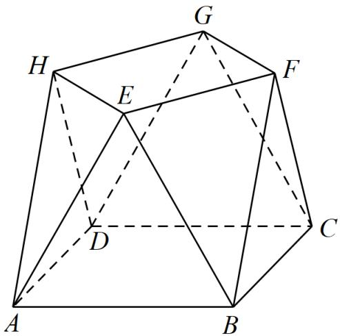

<!-- question-source:start -->
19. 小明同学参加综合实践活动，设计了一个封闭的包装盒，包装盒如图所示：底面 $ABCD$ 是边长为8

（单位：cm）的正方形， $\triangle EAB,\triangle FBC,\triangle GCD,\triangle HDA$ 均为正三角形，且它们所在的平面都与平面

ABCD 垂直.

<!-- question-source:end -->

![[高中/真题/按年份分类/2022/2022年高考全国甲卷数学_文_真题_解析版_/解答题/题目/answers/Q00029239A1.md]]
