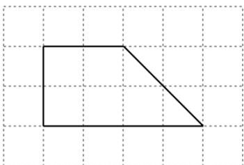
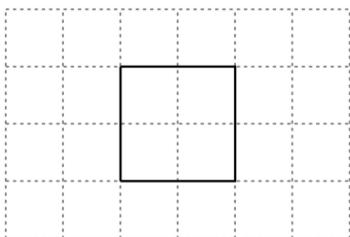
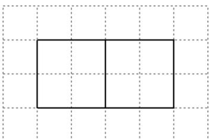

<!-- question-source:start -->
4. 如图，网格纸上绘制的是一个多面体的三视图，网格小正方形的边长为 1，则该多面体的体积为（）

A. 8 B. 12 C. 16 D. 20

【
<!-- question-source:end -->

![[高中/真题/按年份分类/2022/2022年高考全国甲卷数学_文_真题_解析版_/选择题/题目/answers/Q00021709A1.md]]
