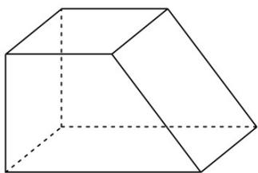

> [!faq]- 2022年高考全国甲卷数学（理）真题（解析版）解析
>
> > [!success]- **【答案】** B
>
> > [!note]- **【分析】**
> > 由三视图还原几何体，再由棱柱的体积公式即可得解.
>
> > [!note]- **【解析】**
> > 由三视图还原几何体，如图，
> >
> > 
> >
> > 则该直四棱柱的体积 $V=\frac{2+4}{2}\times2\times2=12$
> >
> > 故选：B.
