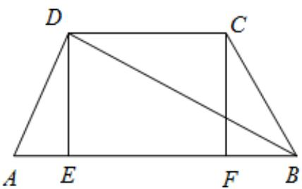
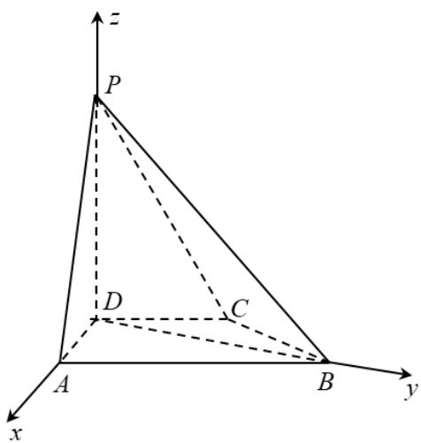

> [!faq]- 2022年高考全国甲卷数学（理）真题（解析版）解析
>
> > [!success]- **【答案】** （1）证明见解析； $$ \sqrt {5} $$ (2) 5
>
> > [!note]- **【分析】**
> > （1）作 $DE \perp AB$ 于 $E$ ， $CF \perp AB$ 于 $F$ ，利用勾股定理证明 $AD \perp BD$ ，根据线面垂直的性质
> >
> > 可得 $PD \perp BD$ ，从而可得 $BD \perp$ 平面 PAD，再根据线面垂直的性质即可得证；
> > (2) 以点 D 为原点建立空间直角坐标系，利用向量法即可得出答案.
>
> > [!note]- **【解析】**
> > 【小问1详解】
> >
> > 证明：在四边形ABCD中，作 $DE \perp AB$ 于E， $CF \perp AB$ 于F，
> >
> > 因为 $CD / / AB, AD = CD = CB = 1, AB = 2$
> >
> > 所以四边形ABCD为等腰梯形，
> >
> > 所以 $AE = BF = \frac{1}{2}$ ,
> >
> > 故 $DE = \frac{\sqrt{3}}{2}$ ， $BD = \sqrt{DE^2 + BE^2} = \sqrt{3}$
> >
> > 所以 $AD^{2} + BD^{2} = AB^{2}$ ,
> >
> > 所以 $AD \perp BD$ ，
> >
> > 因为 $PD \perp$ 平面 ABCD， $BD \subset$ 平面 ABCD，
> >
> > 所以 $PD \perp BD$ ，
> >
> > 又 $PD \cap AD = D$ ，
> >
> > 所以 $BD \perp$ 平面 $PAD$ ，
> >
> > 又因为 $PA \subset$ 平面 PAD，
> >
> > 所以 $BD \perp PA$ ；
> >
> > 
> >
> > 【小问 2 详解】
> >
> > 解：如图，以点 $D$ 为原点建立空间直角坐标系，
> >
> > $$
> > B D = \sqrt {3}
> > $$
> >
> > 则 $A(1,0,0), B(0,\sqrt{3},0), P(0,0,\sqrt{3})$
> >
> > 则 $AP = (-1,0,\sqrt{3}),BP = (0, - \sqrt{3},\sqrt{3}),DP = (0,0,\sqrt{3})$
> >
> > 设平面 PAB 的法向量 $n=(x,y,z)$ ,
> >
> > 则有 $\left\{ \begin{array}{l}n\cdot AP = -x + \sqrt{3} z = 0\\ n\cdot BP = -\sqrt{3} y + \sqrt{3} z = 0 \end{array} \right.$ ，可取 $n = (\sqrt{3},1,1)$
> >
> > 则 $\cos \left\langle n, DP \right\rangle = \frac{n : DP}{|n||DP|} = \frac{\sqrt{5}}{5}$ ,
> >
> > 所以 $PD$ 与平面 $PAB$ 所成角的正弦值为 $\frac{\sqrt{5}}{5}$
> >
> > 
