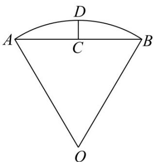

<!-- question-source:start -->
8. 沈括的《梦溪笔谈》是中国古代科技史上的杰作，其中收录了计算圆弧长度的“会圆术”，如图，AB

是以 $O$ 为圆心， $OA$ 为半径的圆弧， $C$ 是 $AB$ 的中点， $D$ 在 $\overline{AB}$ 上， $CD \perp AB$ ．“会圆术”给出 $\overline{AB}$ 的弧

长的近似值 $s$ 的计算公式： $s = AB + \frac{CD^2}{OA}$ 当 $OA = 2,\angle AOB = 60^{\circ}$ 时， $s = (\quad)$

A. $\frac{11 - 3\sqrt{3}}{2}$ B. $\frac{11 - 4\sqrt{3}}{2}$ C. $\frac{9 - 3\sqrt{3}}{2}$ D. $\frac{9 - 4\sqrt{3}}{2}$

【
<!-- question-source:end -->

![[高中/真题/按年份分类/2022/2022年高考全国甲卷数学_理_真题_解析版_/选择题/题目/answers/Q00022227A1.md]]
