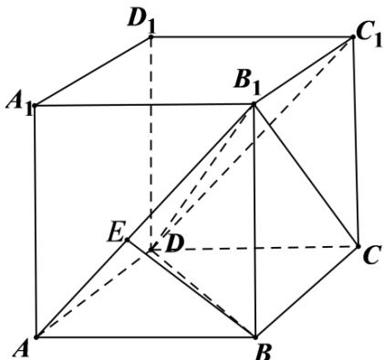

> [!faq]- 2022年高考全国甲卷数学（理）真题（解析版）解析
>
> > [!success]- **【答案】** D
>
> > [!note]- **【分析】**
> > 根据线面角的定义以及长方体的结构特征即可求出.
>
> > [!note]- **【解析】**
> > 如图所示：
> >
> > 
> >
> > 不妨设 $AB = a, AD = b, AA_{1} = c$ ，依题以及长方体的结构特征可知， $B_{1}D$ 与平面 $ABCD$ 所成角为
> >
> > $\angle B_{1}DB$ ， $B_{1}D$ 与平面 $AA_{1}B_{1}B$ 所成角为 $\angle DB_{1}A$ ，所以 $\sin 30^{\circ} = \frac{c}{B_1D} = \frac{b}{B_1D}$ ，即 $b = c$
> >
> > $B_{1}D=2c=\sqrt{a^{2}+b^{2}+c^{2}}$ ，解得 $a=\sqrt{2}c$ 。
> >
> > 对于 A， $AB = a$ ，AD = b， $AB = \sqrt{2} AD$ ，A 错误；
> >
> > 对于B，过 $^{B}$ 作 $^{BE\perp AB_{1}}$ 于E，易知 $^{BE\perp 平面}AB_{1}C_{1}D$ ，所以AB与平面 $^{AB_{1}C_{1}D}$ 所成角为 $\angle BAE$ ，
> >
> > 因为 $\tan \angle BAE = \frac{c}{a} = \frac{\sqrt{2}}{2}$ ，所以 $\angle BAE \neq 30^{\circ}$ ，B错误；
> >
> > 对于 C， $AC=\sqrt{a^{2}+b^{2}}=\sqrt{3}c$ ， $CB_{1}=\sqrt{b^{2}+c^{2}}=\sqrt{2}c$ ， $AC\neq CB_{1}$ ，C 错误；
> >
> > 对于D， $B_{1}D$ 与平面 $BB_{1}C_{1}C$ 所成角为 $\angle DB_{1}C$ ， $\sin \angle DB_{1}C = \frac{CD}{B_{1}D} = \frac{a}{2c} = \frac{\sqrt{2}}{2}$ ，而 $0 < \angle DB_{1}C < 90^{\circ}$ 所以 $\angle DB_{1}C = 45^{\circ}$ .D正确.
> >
> > 故选：D.
