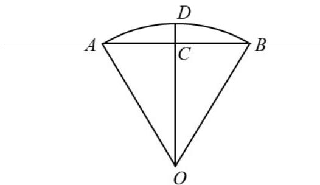

> [!faq]- 2022年高考全国甲卷数学（理）真题（解析版）解析
>
> > [!success]- **【答案】** B
>
> > [!note]- **【分析】**
> > 连接 $OC$ ，分别求出 $AB, OC, CD$ ，再根据题中公式即可得出
>
> > [!note]- **【解析】**
> > 解：如图，连接 $OC$ ，
> >
> > 因为 C 是 AB 的中点，
> >
> > 所以 $OC \perp AB$ ，
> >
> > 又 $CD \perp AB$ ，所以 $O, C, D$ 三点共线，
> >
> > 即 OD = OA = OB = 2，
> >
> > 又 $\angle AOB = 60^{\circ}$
> >
> > 所以 AB = OA = OB = 2，
> >
> > 则 $OC = \sqrt{3}$ ，故 $CD = 2 - \sqrt{3}$
> >
> > 所以 $s = AB + \frac{CD^{2}}{OA} = 2 + \frac{(2 - \sqrt{3})^{2}}{2} = \frac{11 - 4\sqrt{3}}{2}$ .
> >
> > 故选：B.
> >
> > 
