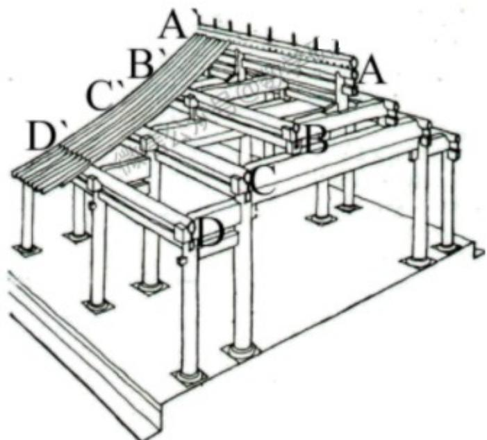
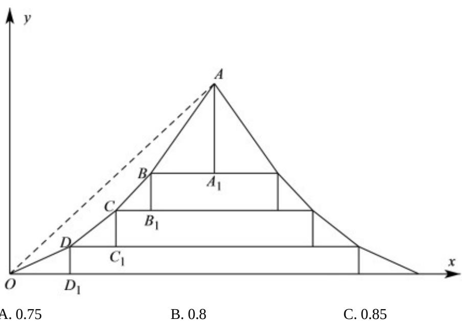

<!-- question-source:start -->
3. 中国的古建筑不仅是挡风遮雨的住处，更是美学和哲学的体现。如图是某古建筑物的剖面图， $DD_{1}, CC_{1}, BB_{1}, AA_{1}$ 是举， $OD_{1}, DC_{1}, CB_{1}, BA_{1}$ 是相等的步，相邻桁的举步之比分别为 $\frac{DD_1}{OD_1} = 0.5, \frac{CC_1}{DC_1} = k_1, \frac{BB_1}{CB_1} = k_2, \frac{AA_1}{BA_1} = k_3$ ，若 $k_1, k_2, k_3$ 是公差为 0.1 的等差数列，且直线 $OA$ 的斜率为 0.725，则 $k_3 = (\quad)$

<!-- question-source:end -->

![[高中/真题/按年份分类/2022/精品解析_2022年全国新高考II卷数学试题_解析版_/一_选择题/题目/answers/Q00020468A1.md]]
