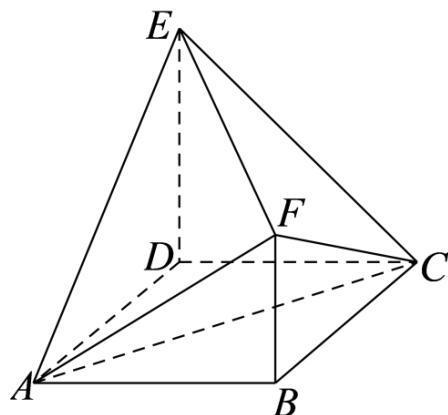

<!-- question-source:start -->
11. 如图，四边形 $ABCD$ 为正方形， $ED \perp$ 平面 $ABCD$ ， $FB \parallel ED, AB = ED = 2FB$ ，记三棱锥 $E - ACD$ ， $F - ABC$ ， $F - ACE$ 的体积分别为 $V_{1}, V_{2}, V_{3}$ ，则（）

$$
V _ {3} = 2 V _ {2}
$$

$$
V _ {3} = 2 V _ {1}
$$

C. $V_{3} = V_{1} + V_{2}$ D. $2V_{3} = 3V_{1}$
<!-- question-source:end -->

![[高中/真题/按年份分类/2022/精品解析_2022年全国新高考II卷数学试题_解析版_/二_选择题/题目/answers/Q00020476A1.md]]
