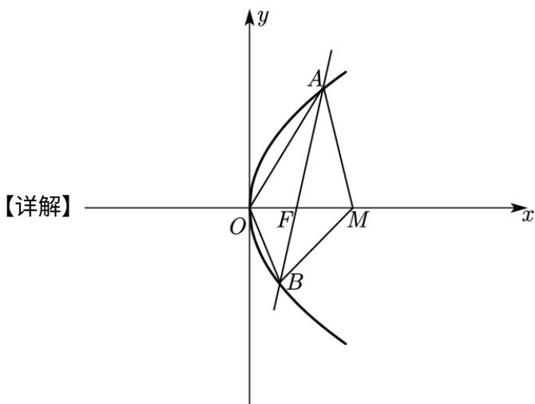

> [!faq]- 精品解析：2022年全国新高考II卷数学试题（解析版）解析
>
> > [!success]- **【答案】** ACD
>
> > [!note]- **【分析】**
> > 由 $|AF|=|AM|$ 及抛物线方程求得 $A(\frac{3p}{4},\frac{\sqrt{6}p}{2})$ ，再由斜率公式即可判断A选项；表示出直线AB的方程，联立抛物线求得 $B(\frac{p}{3},-\frac{\sqrt{6}p}{3})$ ，即可求出 $|OB|$ 判断B选项；由抛物线的定义求出 $|AB|=\frac{25p}{12}$ 即可判断C选项；由 $OA\cdot OB<0,\quad MA\cdot MB<0$ 求得 $\angle AOB,\quad\angle AMB$ 为钝角即可判断D选项.
>
> > [!note]- **【解析】**
> > 
> >
> > 对于A，易得 $F\left(\frac{p}{2},0\right)$ ，由 $\left|AF\right| = \left|AM\right|$ 可得点在 $FM$ 的垂直平分线上，则A点横坐标为 $\frac{\frac{p}{2} + p}{2} = \frac{3p}{4}$
> >
> > 代入抛物线可得 $y^{2} = 2p \cdot \frac{3p}{4} = \frac{3}{2} p^{2}$ ，则 $A(\frac{3p}{4}, \frac{\sqrt{6}p}{2})$ ，则直线 $_{AB}$ 的斜率为 $\frac{\frac{\sqrt{6}p}{2}}{\frac{3p}{4} - \frac{p}{2}} = 2\sqrt{6}$ ，A 正确；
> >
> > 对于B，由斜率为 $2\sqrt{6}$ 可得直线 $AB$ 的方程为 $x = \frac{1}{2\sqrt{6}} y + \frac{p}{2}$ ，联立抛物线方程得
> >
> > $$
> > y ^ {2} - \frac {1}{\sqrt {6}} p y - p ^ {2} = 0,
> > $$
> >
> > 设 $B(x_{1},y_{1})$ ，则 $\frac{\sqrt{6}}{2} p + y_1 = \frac{\sqrt{6}}{6} p$ ，则 $y_{1} = -\frac{\sqrt{6}p}{3}$ ，代入抛物线得 $\left(-\frac{\sqrt{6}p}{3}\right)^2 = 2p\cdot x_1,$ 解得 $x_{1} = \frac{p}{3}$ ，则 $B(\frac{p}{3}, - \frac{\sqrt{6}p}{3})$
> >
> > 则 $\left|OB\right|=\sqrt{\left(\frac{p}{3}\right)^{2}+\left(-\frac{\sqrt{6}p}{3}\right)^{2}}=\frac{\sqrt{7}p}{3}\neq\left|OF\right|=\frac{p}{2}$ ，B错误；
> >
> > 对于C，由抛物线定义知： $\left|AB\right|=\frac{3p}{4}+\frac{p}{3}+p=\frac{25p}{12}>2p=4\left|OF\right|$ ，C正确；
> >
> > 对于D， $OA\cdot OB = \left(\frac{3p}{4},\frac{\sqrt{6}p}{2}\right)\cdot \left(\frac{p}{3}, - \frac{\sqrt{6}p}{3}\right) = \frac{3p}{4}\cdot \frac{p}{3} +\frac{\sqrt{6}p}{2}\cdot \left(-\frac{\sqrt{6}p}{3}\right) = -\frac{3p^2}{4} < 0$ ，则∠AOB为钝角，又 $MA\cdot MB = (-\frac{p}{4},\frac{\sqrt{6}p}{2})\cdot (-\frac{2p}{3}, - \frac{\sqrt{6}p}{3}) = -\frac{p}{4}\cdot \left(-\frac{2p}{3}\right) + \frac{\sqrt{6}p}{2}\cdot \left(-\frac{\sqrt{6}p}{3}\right) = -\frac{5p^2}{6} < 0,$ 则∠AMB为钝角，又∠AOB+∠AMB+∠OAM+∠OBM=360°，则∠OAM+∠OBM<180°，D正确.故选：ACD.
