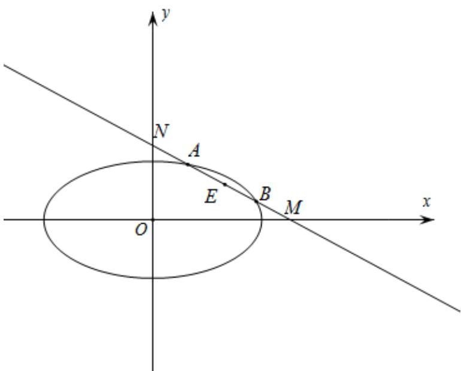

> [!faq]- 精品解析：2022年全国新高考II卷数学试题（解析版）解析
>
> > [!success]- **【答案】** $x + \sqrt{2} y - 2\sqrt{2} = 0$ 【
>
> > [!note]- **【分析】**
> > 令 $AB$ 的中点为 $E$ ，设 $A(x_1, y_1)$ ， $B(x_2, y_2)$ ，利用点差法得到 $k_{OE} \cdot k_{AB} = -\frac{1}{2}$ ，设直线 $AB:y = kx + m$ ， $k < 0$ ， $m > 0$ ，求出 $M$ 、 $N$ 的坐标，再根据 $\left|MN\right|$ 求出 $k$ 、 $m$ ，即可得解；
>
> > [!note]- **【解析】**
> > 解：令 $AB$ 的中点为 $E$ ，因为 $\left|MA\right| = \left|NB\right|$ ，所以 $\left|ME\right| = \left|NE\right|$
> >
> > 设 $A(x_{1},y_{1})$ ， $B(x_{2},y_{2})$ ，则 $\frac{x_1^2}{6} +\frac{y_1^2}{3} = 1$ ， $\frac{x_2^2}{6} +\frac{y_2^2}{3} = 1$
> >
> > 所以 $\frac{x_1^2}{6} -\frac{x_2^2}{6} +\frac{y_1^2}{3} -\frac{y_2^2}{3} = 0$ ，即 $\frac{(x_1 - x_2)(x_1 + x_2)}{6} +\frac{(y_1 + y_2)(y_1 - y_2)}{3} = 0$
> >
> > 所以 $\frac{(y_1 + y_2)(y_1 - y_2)}{(x_1 - x_2)(x_1 + x_2)} = -\frac{1}{2}$ ，即 $k_{OE} \cdot k_{AB} = -\frac{1}{2}$ ，设直线 $AB: y = kx + m$ ， $k < 0$
> >
> > $$
> > m > 0
> > $$
> >
> > 令 $x = 0$ 得 $y = m$ ，令 $y = 0$ 得 $x = -\frac{m}{k}$ ，即 $M\left(-\frac{m}{k},0\right)$ ， $N(0,m)$ ，所以 $E\left(-\frac{m}{2k},\frac{m}{2}\right)$
> >
> > 即 $k \times \frac{\frac{m}{2}}{-\frac{m}{2k}} = -\frac{1}{2}$ ，解得 $k = -\frac{\sqrt{2}}{2}$ 或 $k = \frac{\sqrt{2}}{2}$ （舍去），
> >
> > 又 $|MN|=2\sqrt{3}$ ，即 $|MN|=\sqrt{m^{2}+\left(\sqrt{2}m\right)^{2}}=2\sqrt{3}$ ，解得 $m=2$ 或 $m=-2$ （舍去），
> >
> > 所以直线 $AB:y = -\frac{\sqrt{2}}{2} x + 2$ ，即 $x + \sqrt{2} y - 2\sqrt{2} = 0$
> >
> > 
> >
> > 故
