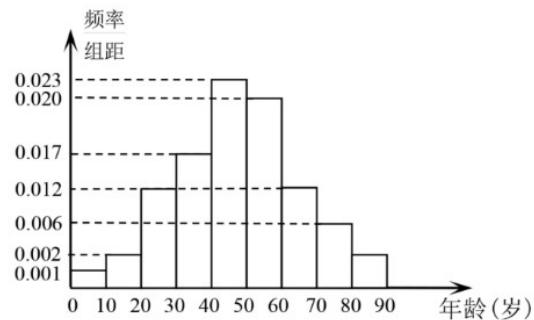

<!-- question-source:start -->
19. 在某地区进行流行病调查，随机调查了 100 名某种疾病患者的年龄，得到如下的样本数据频率分布直方图.

(1) 估计该地区这种疾病患者的平均年龄（同一组中的数据用该组区间的中点值作代表）；

(2) 估计该地区一人患这种疾病年龄在区间 $[20,70)$ 的概率；

(3) 已知该地区这种疾病的患病率为 $0.1\%$ ，该地区年龄位于区间[40,50)的人口占该地区总人口的 $16\%$ ，从该地区任选一人，若此人年龄位于区间[40,50)，求此人患该种疾病的概率。（样本数据中的患者年龄位于各区间的频率作为患者年龄位于该区间的概率，精确到0.0001）

【
<!-- question-source:end -->

![[高中/真题/按年份分类/2022/精品解析_2022年全国新高考II卷数学试题_解析版_/解答题/题目/answers/Q00022216A1.md]]
