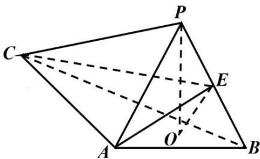

<!-- question-source:start -->
20. 如图，PO 是三棱锥 P - ABC 的高，PA = PB， $AB \perp AC$ ，E 是 PB 的中点.

(1) 求证: $OE \parallel$ 平面 $PAC$ ;

(2) 若 $\angle ABO = \angle CBO = 30^{\circ}$ , $PO = 3$ , $PA = 5$ , 求二面角 $C - AE - B$ 的正弦值.

【
<!-- question-source:end -->

![[高中/真题/按年份分类/2022/精品解析_2022年全国新高考II卷数学试题_解析版_/解答题/题目/answers/Q00022217A1.md]]
