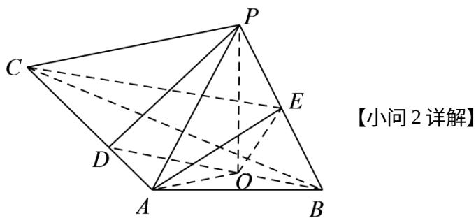
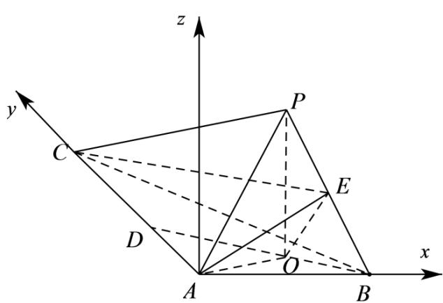
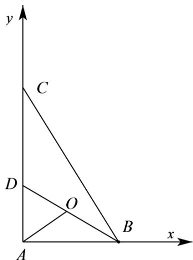

> [!faq]- 精品解析：2022年全国新高考II卷数学试题（解析版）解析
>
> > [!success]- **【答案】** (1) 证明见
>
> > [!note]- **【分析】**
> > （1）连接 BO 并延长交 AC 于点 D，连接 OA、PD，根据三角形全等得到 OA = OB，再根据直角三角形的性质得到 AO = DO，即可得到 O 为 BD 的中点从而得到 OE // PD，即可得证；
> > (2) 过点 A 作 $Az // OP$ ，如图建立平面直角坐标系，利用空间向量法求出二面角的余弦值，再根据同角三角函数的基本关系计算可得；
>
> > [!note]- **【解析】**
> > 证明：连接 BO 并延长交 AC 于点 D，连接 OA、PD，
> >
> > 因为 $PO$ 是三棱锥 $P - ABC$ 的高，所以 $PO \perp$ 平面 $ABC$ ， $AO, BO \subset$ 平面 $ABC$ 所以 $PO \perp AO$ 、 $PO \perp BO$ ，
> >
> > 又 $PA = PB$ ，所以 $\triangle POA\cong \triangle POB$ ，即 $OA = OB$ ，所以 $\angle OAB = \angle OBA$
> >
> > 又 $AB \perp AC$ ，即 $\angle BAC = 90^{\circ}$ ，所以 $\angle OAB + \angle OAD = 90^{\circ}$ ， $\angle OBA + \angle ODA = 90^{\circ}$ ，所以 $\angle ODA = \angle OAD$
> >
> > 所以 AO = DO，即 AO = DO = OB，所以 O 为 BD 的中点，又 E 为 PB 的中点，所以 OE // PD，
> >
> > 又 $OE \notin$ 平面 $PAC$ ， $PD \subset$ 平面 $PAC$ ，
> >
> > 
> >
> > 解：过点 A 作 $Az \parallel OP$ ，如图建立平面直角坐标系，
> >
> > 因为 $PO = 3$ ， $AP = 5$ ，所以 $OA = \sqrt{AP^2 - PO^2} = 4$
> >
> > 
> >
> > 
> >
> > 又 $\angle OBA = \angle OBC = 30^{\circ}$ ，所以 $BD = 2OA = 8$ ，则 $AD = 4$ ， $AB = 4\sqrt{3}$
> >
> > 所以 $AC = 12$ ，所以 $O(2\sqrt{3},2,0)$ ， $B(4\sqrt{3},0,0)$ ， $P(2\sqrt{3},2,3)$ ， $C(0,12,0)$ ，所以 $E\left(3\sqrt{3},1,\frac{3}{2}\right),$
> >
> > 则 $AE = \left(3\sqrt{3}, 1, \frac{3}{2}\right)$ ， $AB = (4\sqrt{3}, 0, 0)$ ， $AC = (0, 12, 0)$ ，
> >
> > 设平面法向量为，则 $\left\{ \begin{array}{l} n \cdot AE = 3\sqrt{3} x + y + \frac{3}{2} z = 0 \\ n \cdot AB = 4\sqrt{3} x = 0 \end{array} \right.$ ，令，则 $n = (x, y, z)$
> >
> > $y = -3, \quad x = 0$ ，所以 $n = (0, -3, 2)$ ;
> >
> > 设平面 的法向量为 $m = (a, b, c)$ ，则 $\left\{ \begin{array}{l} m \cdot AE = 3\sqrt{3}a + b + \frac{3}{2}c = 0 \\ m \cdot AC = 12b = 0 \end{array} \right.$ ，令 $a = \sqrt{3}$ 则 $c = -6$ ， $b = 0$ ，所以 $m = (\sqrt{3}, 0, -6)$ ；
> >
> > 所以 $\cos\left\langle n,m\right\rangle=\frac{n;m}{|n||m|}=\frac{-12}{\sqrt{13}\times\sqrt{39}}=-\frac{4\sqrt{3}}{13}$
> >
> > 设二面角 $C - AE - B$ 为 $\theta$ ，由图可知二面角 $C - AE - B$ 为钝二面角，
> >
> > 所以 $\cos \theta = -\frac{4\sqrt{3}}{13}$ ，所以 $\sin \theta = \sqrt{1 - \cos^2\theta} = \frac{11}{13}$
> >
> > 故二面角 $C - AE - B$ 的正弦值为 $\frac{11}{13}$ ；
