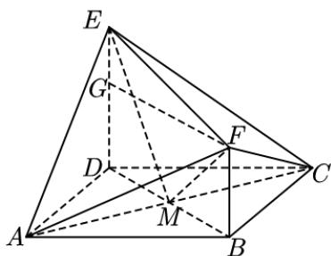

> [!faq]- 精品解析：2022年全国新高考II卷数学试题（解析版）解析
>
> > [!success]- **【答案】** CD 【
>
> > [!note]- **【分析】**
> > 直接由体积公式计算 $V_{1}, V_{2}$ ，连接BD交AC于点M，连接EM, FM，由 $V_{3}=V_{A-EFM}+V_{C-EFM}$ 计算出 $V_{3}$ ，依次判断选项即可.
>
> > [!note]- **【解析】**
> > 
> >
> > 设 AB = ED = 2FB = 2a，因为 $ED \perp$ 平面 ABCD， $FB \parallel ED$ ，则 $V_{1}=\frac{1}{3}\cdot ED\cdot S_{\triangle ACD}=\frac{1}{3}\cdot2a\cdot\frac{1}{2}\cdot(2a)^{2}=\frac{4}{3}a^{3}$
> >
> > $V_{2}=\frac{1}{3}\cdot FB\cdot S_{\triangle ABC}=\frac{1}{3}\cdot a\cdot\frac{1}{2}\cdot(2a)^{2}=\frac{2}{3}a^{3}$ ，连接 $_{BD}$ 交AC于点 $_{M}$ ，连接EM,FM，易得 $BD\perp AC$ ，
> >
> > 又 $ED \perp$ 平面 $ABCD$ ， $AC \subset$ 平面 $ABCD$ ，则 $ED \perp AC$ ，又 $ED \cap BD = D$ ， $ED, BD \subset$ 平面 $BDEF$ ，则 $AC \perp$ 平面 $BDEF$ ，
> >
> > 又 $BM = DM = \frac{1}{2} BD = \sqrt{2} a$ ，过 $_F$ 作 $FG\perp DE$ 于 $G$ ，易得四边形 $BDGF$ 为矩形，则 $FG = BD = 2\sqrt{2} a,EG = a$
> >
> > 则 $EM = \sqrt{(2a)^2 + (\sqrt{2}a)^2} = \sqrt{6} a, FM = \sqrt{a^2 + (\sqrt{2}a)^2} = \sqrt{3} a$
> >
> > $$
> > E F = \sqrt {a ^ {2} + (2 \sqrt {2} a) ^ {2}} = 3 a
> > $$
> >
> > $EM^{2}+FM^{2}=EF^{2}$ ，则 $EM\perp FM$ ， $S_{\triangle EFM}=\frac{1}{2}EM\cdot FM=\frac{3\sqrt{2}}{2}a^{2}$ ， $AC=2\sqrt{2}a$ ，
> > 则 $V_{3}=V_{A-EFM}+V_{C-EFM}=\frac{1}{3}AC\cdot S_{\triangle EFM}=2a^{3}$ ，则 $2V_{3}=3V_{1}$ ， $V_{3}=3V_{2}$ ， $V_{3}=V_{1}+V_{2}$ ，故A、B错误；C、D正确.
> >
> > 故选：CD.
