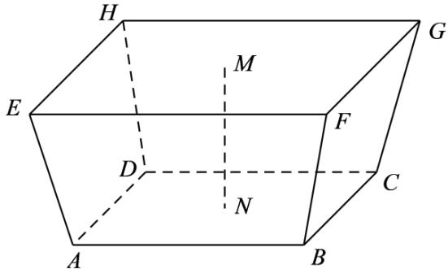

> [!faq]- 精品解析：2022年全国新高考I卷数学试题（解析版）解析
>
> > [!success]- **【答案】** C
>
> > [!note]- **【分析】**
> > 根据题意只要求出棱台的高，即可利用棱台的体积公式求出.
>
> > [!note]- **【解析】**
> > 依题意可知棱台的高为 $MN = 157.5 - 148.5 = 9(\mathrm{m})$ ，所以增加的水量即为棱台的体积 $V$ ：
> >
> > 棱台上底面积 $S = 140.0\mathbf{km}^2 = 140\times 10^6\mathbf{m}^2$ ，下底面积 $S^{\prime} = 180.0\mathbf{km}^{2} = 180\times 10^{6}\mathbf{m}^{2}$ $\therefore V = \frac{1}{3} h(S + S' + \sqrt{SS'}) = \frac{1}{3}\times 9\times (140\times 10^6 +180\times 10^6 +\sqrt{140\times 180\times 10^{12}})$
> >
> > $$
> > = 3 \times (3 2 0 + 6 0 \sqrt {7}) \times 1 0 ^ {6} \approx (9 6 + 1 8 \times 2. 6 5) \times 1 0 ^ {7} = 1. 4 3 7 \times 1 0 ^ {9} \approx 1. 4 \times 1 0 ^ {9} \left(\mathrm{m} ^ {3}\right)
> > $$
> >
> > 
> >
> > 故选：C.
