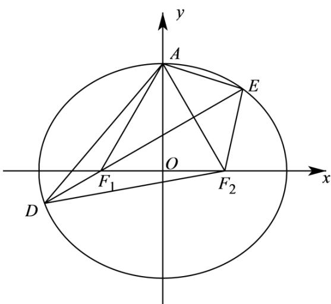

> [!faq]- 精品解析：2022年全国新高考I卷数学试题（解析版）解析
>
> > [!success]- **【答案】** 13
>
> > [!note]- **【分析】**
> > 利用离心率得到椭圆的方程为 $\frac{x^2}{4c^2} +\frac{y^2}{3c^2} = 1$ ，即 $3x^{2} + 4y^{2} - 12c^{2} = 0$ ，根据离心率得到直线 $AF_{2}$ 的斜率，进而利用直线的垂直关系得到直线 $DE$ 的斜率，写出直线 $DE$ 的方程： $x = \sqrt{3} y - c$ ，代入椭圆方程 $3x^{2} + 4y^{2} - 12c^{2} = 0$ ，整理化简得到： $13y^{2} - 6\sqrt{3} cy - 9c^{2} = 0$ ，利用弦长公式求得 $c = \frac{13}{8}$ ，得 $a = 2c = \frac{13}{4}$ ，根据对称性将 $\triangle ADE$ 的周长转化为 $\triangle F_2DE$ 的周长，利用椭圆的定义得到周长为 $4a = 13$ ：
>
> > [!note]- **【解析】**
> > ∵椭圆的离心率为 $e=\frac{c}{a}=\frac{1}{2}$ ，∴a=2c，∴ $b^{2}=a^{2}-c^{2}=3c^{2}$ ，∴椭圆的方程为 $\frac{x^{2}}{4c^{2}}+\frac{y^{2}}{3c^{2}}=1$ ，即 $3x^{2}+4y^{2}-12c^{2}=0$ ，不妨设左焦点为 $F_{1}$ ，右焦点为 $F_{2}$ ，如图所示，$\because AF_{2} = a, OF_{2} = c, a = 2c, \therefore \angle AF_{2}O = \frac{\pi}{3}, \therefore \triangle AF_{1}F_{2}$ 为正三角形， $\because$ 过 $F_{1}$ 且垂直于 $AF_{2}$ 的直线与 $C$ 交于 $D, E$ 两点， $DE$ 为线段 $AF_{2}$ 的垂直平分线， $\therefore$ 直线 $DE$ 的斜率为 $\frac{\sqrt{3}}{3}$ ，斜率倒数为 $\sqrt{3}$ ，直线 $DE$ 的方程： $x = \sqrt{3}y - c$ ，代入椭圆方程
> >
> > $3x^{2} + 4y^{2} - 12c^{2} = 0$ ，整理化简得到： $13y^{2} - 6\sqrt{3} cy - 9c^{2} = 0$
> >
> > 判别式 $\widehat{7} = (6\sqrt{3} c)^2 + 4 \times 13 \times 9c^2 = 6^2 \times 16 \times c^2$
> >
> > $$
> > \therefore | C D | = \sqrt {1 + (\sqrt {3}) ^ {2}} \left| y _ {1} - y _ {2} \right| = 2 \times \frac {\sqrt {\text {②}}}{1 3} = 2 \times 6 \times 4 \times \frac {c}{1 3} = 6,
> > $$
> >
> > $\therefore c = \frac{13}{8}$ ，得 $a = 2c = \frac{13}{4}$
> >
> > $\because DE$ 为线段 $AF_{2}$ 的垂直平分线，根据对称性， $AD = DF_{2}, AE = EF_{2}$ ， $\therefore \triangle ADE$ 的周长等于 $\triangle F_{2}DE$ 的周长，利用椭圆的定义得到 $\triangle F_{2}DE$ 周长为
> >
> > $$
> > \left| D F _ {2} \right| + \left| E F _ {2} \right| + | D E | = \left| D F _ {2} \right| + \left| E F _ {2} \right| + \left| D F _ {1} \right| + \left| E F _ {1} \right| = \left| D F _ {1} \right| + \left| D F _ {2} \right| + \left| E F _ {1} \right| + \left| E F _ {2} \right| = 2 a + 2 a = 4 a = 1 3
> > $$
> >
> > 故答案为：13.
> >
> > 
