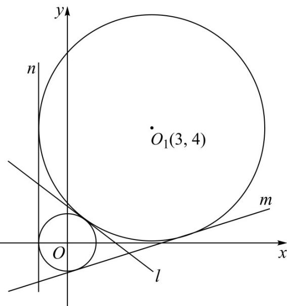

> [!faq]- 精品解析：2022年全国新高考I卷数学试题（解析版）解析
>
> > [!success]- **【答案】** $y = -\frac{3}{4} x + \frac{5}{4}$ 或 $y = \frac{7}{24} x - \frac{25}{24}$ 或 $x = -1$
>
> > [!note]- **【分析】**
> > 先判断两圆位置关系，分情况讨论即可.
>
> > [!note]- **【解析】**
> > 圆 $x^{2} + y^{2} = 1$ 的圆心为 $O(0,0)$ ，半径为1，圆 $(x - 3)^{2} + (y - 4)^{2} = 16$ 的圆心 $O_{1}$
> >
> > 为 $(3,4)$ ，半径为4，
> >
> > 两圆圆心距为 $\sqrt{3^2 + 4^2} = 5$ ，等于两圆半径之和，故两圆外切，如图，当切线为 $l$ 时，因为 $k_{\mathrm{OO_1}} = \frac{4}{3}$ ，所以 $k_{l} = -\frac{3}{4}$ ，设方程为 $y = -\frac{3}{4} x + t(t > 0)$ O到 $l$ 的距离 $d = \frac{|t|}{\sqrt{1 + \frac{9}{16}}} = 1$ ，解得 $t = \frac{5}{4}$ ，所以 $l$ 的方程为 $y = -\frac{3}{4} x + \frac{5}{4}$ 当切线为 $m$ 时，设直线方程为 $kx + y + p = 0$ ，其中 $p > 0$ ， $k < 0$ ，由题意 $\left\{ \begin{array}{l} \frac{|p|}{\sqrt{1 + k^2}} = 1 \\ \frac{|3k + 4 + p|}{\sqrt{1 + k^2}} = 4 \end{array} \right.$ ，解得 $\left\{ \begin{array}{l} k = -\frac{7}{24}, \\ p = \frac{25}{24}, \quad y = \frac{7}{24} x - \frac{25}{24} \end{array} \right.$ 当切线为 $n$ 时，易知切线方程为 $x = -1$ 故答案为： $y = -\frac{3}{4} x + \frac{5}{4}$ 或 $y = \frac{7}{24} x - \frac{25}{24}$ 或 $x = -1$
> >
> > 
