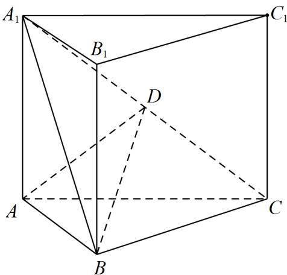

<!-- question-source:start -->
19. 如图，直三棱柱 $ABC - A_{1}B_{1}C_{1}$ 的体积为 4， $\triangle A_{1}BC$ 的面积为 $2\sqrt{2}$ .

<!-- question-source:end -->

![[高中/真题/按年份分类/2022/精品解析_2022年全国新高考I卷数学试题_解析版_/解答题/题目/answers/Q00029260A1.md]]
