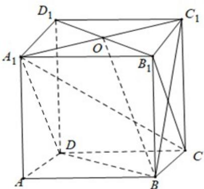

> [!faq]- 精品解析：2022年全国新高考I卷数学试题（解析版）解析
>
> > [!success]- **【答案】** ABD
>
> > [!note]- **【分析】**
> > 数形结合，依次对所给选项进行判断即可.
>
> > [!note]- **【解析】**
> > 如图，连接 $B_{1}C$ 、 $BC_{1}$ ，因为 $DA_{1} / / B_{1}C$ ，所以直线 $BC_{1}$ 与 $B_{1}C$ 所成的角即为直线 $BC_{1}$ 与 $DA_{1}$ 所成的角，
> >
> > 因为四边形 $BB_{1}C_{1}C$ 为正方形，则 $B_{1}C \perp BC_{1}$ ，故直线 $BC_{1}$ 与 $DA_{1}$ 所成的角为 $90^{\circ}$ ，A 正确；
> >
> > 
> >
> > 连接 $A_{1}C$ ，因为 $A_{1}B_{1}\perp$ 平面 $BB_{1}C_{1}C$ ， $BC_{1}\subset$ 平面 $BB_{1}C_{1}C$ ，则 $A_{1}B_{1}\perp BC_{1}$ 因为 $B_{1}C\perp BC_{1}$ ， $A_{1}B_{1}\cap B_{1}C = B_{1}$ ，所以 $BC_{1}\perp$ 平面 $A_{1}B_{1}C$ 又 $A_{1}C\subset$ 平面 $A_{1}B_{1}C$ ，所以 $BC_{1}\perp CA_{1}$ ，故B正确；  
> > 连接 $A_{1}C_{1}$ ，设 $A_{1}C_{1}\cap B_{1}D_{1} = O$ ，连接BO，因为 $BB_{1}\perp$ 平面 $A_{1}B_{1}C_{1}D_{1}$ ， $C_1O\subset$ 平面 $A_{1}B_{1}C_{1}D_{1}$ ，则 $C_1O\perp B_1B$ 因为 $C_1O\perp B_1D_1$ ， $B_{1}D_{1}\cap B_{1}B = B_{1}$ ，所以 $C_1O\perp$ 平面 $BB_{1}D_{1}D$ 所以 $\angle C_1BO$ 为直线 $BC_{1}$ 与平面 $BB_{1}D_{1}D$ 所成的角，
> >
> > 设正方体棱长为 $_{1}$ ，则 $C_{1}O=\frac{\sqrt{2}}{2}$ ， $BC_{1}=\sqrt{2}$ ， $\sin\angle C_{1}BO=\frac{C_{1}O}{BC_{1}}=\frac{1}{2}$ ，
> >
> > 所以，直线 $BC_{1}$ 与平面 $BB_{1}D_{1}D$ 所成的角为 $30^{\circ}$ ，故 C 错误；
> >
> > 因为 $C_1C \perp$ 平面 $ABCD$ ，所以 $\angle C_1BC$ 为直线 $BC_1$ 与平面 $ABCD$ 所成的角，易得 $\angle C_1BC = 45^\circ$ ，故 D 正确.
> >
> > 故选：ABD
