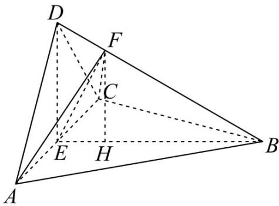

> [!faq]- 精品解析：2022年全国高考乙卷数学（文）试题（解析版）解析
>
> > [!success]- **【答案】** （1）证明详见
>
> > [!note]- **【分析】**
> > （1）通过证明 $AC \perp$ 平面 BED 来证得平面 $BED \perp$ 平面 ACD.
> > (2) 首先判断出三角形 $AFC$ 的面积最小时 $F$ 点的位置, 然后求得 $F$ 到平面 $ABC$ 的距离, 从而求得三棱锥 $F - ABC$ 的体积.
>
> > [!note]- **【解析】**
> > 由于 AD = CD，E 是 AC 的中点，所以 $AC \perp DE$ .
> >
> > 由于 $\left\{ \begin{array}{l}AD = CD\\ BD = BD\\ \angle ADB = \angle CDB \end{array} \right.$ ，所以所以 $AB = CB$ ，故 $AC \perp BD$
> >
> > 由于 $DE \cap BD = D$ ， $DE, BD\dot{I}$ 平面 $BED$ ，
> >
> > 所以 $AC \perp$ 平面 $BED$ ，
> >
> > 由于 $AC \subset$ 平面 $ACD$ ，所以平面 $BED \perp$ 平面 $ACD$ .
> >
> > 【
> >
> > 小问 2
> >
> > 依题意 $AB = BD = BC = 2$ ， $\angle ACB = 60^{\circ}$ ，三角形 $ABC$ 是等边三角形，
> >
> > 所以 AC = 2, AE = CE = 1, BE = $\sqrt{3}$ ,
> >
> > 由于 $AD = CD, AD \perp CD$ ，所以三角形 $ACD$ 是等腰直角三角形，所以 $DE = 1$
> >
> > $DE^{2} + BE^{2} = BD^{2}$ ，所以 $DE\perp BE$
> >
> > 由于 $AC \cap BE = E$ ，AC, $BE \subset$ 平面 ABC，所以 $DE \perp$ 平面 ABC.
> >
> > 由于 $\triangle ADB\cong \triangle CDB$ ，所以 $\angle FBA = \angle FBC$
> >
> > 由于 $\left\{ \begin{array}{l}BF = BF\\ \angle FBA = \angle FBC\\ AB = CB \end{array} \right.$ ，所以
> >
> > 所以 AF = CF ，所以 $EF \perp AC$ ，
> >
> > 由于 $S_{\triangle AFC} = \frac{1}{2}\cdot AC\cdot EF$ ，所以当 $EF$ 最短时，三角形 $AFC$ 的面积最小值.
> >
> > 过 $E$ 作 $EF \perp BD$ ，垂足为 $F$ ，
> >
> > 在 $Rt\triangle BED$ 中， $\frac{1}{2} \cdot BE \cdot DE = \frac{1}{2} \cdot BD \cdot EF$ ，解得 $EF = \frac{\sqrt{3}}{2}$ ，
> >
> > 所以 $DF = \sqrt{1^2 - \left(\frac{\sqrt{3}}{2}\right)^2} = \frac{1}{2}, BF = 2 - DF = \frac{3}{2},$
> >
> > 所以 $\frac{BF}{BD}=\frac{3}{4}$
> >
> > 过 $F$ 作 $FH \perp BE$ ，垂足为 $H$ ，则 $FH // DE$ ，所以 $FH \perp$ 平面 $ABC$ ，且 $\frac{FH}{DE} = \frac{BF}{BD} = \frac{3}{4}$ ，
> >
> > 所以 $FH = \frac{3}{4}$ ,
> >
> > 所以 $V_{F-ABC}=\frac{1}{3}\cdot S_{\triangle ABC}\cdot FH=\frac{1}{3}\times\frac{1}{2}\times2\times\sqrt{3}\times\frac{3}{4}=\frac{\sqrt{3}}{4}.$
> >
> > 
