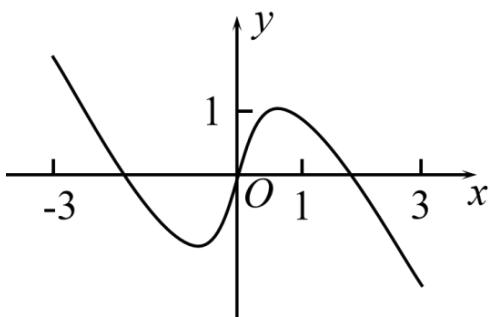

<!-- question-source:start -->
8. 如图是下列四个函数中的某个函数在区间 $[-3, 3]$ 的大致图像，则该函数是（）

A. $y = \frac{-x^3 + 3x}{x^2 + 1}$ B. $y = \frac{x^3 - x}{x^2 + 1}$ C. $y = \frac{2x\cos x}{x^2 + 1}$ D.

$$
y = \frac {2 \sin x}{x ^ {2} + 1}
$$

【
<!-- question-source:end -->

![[高中/真题/按年份分类/2022/精品解析_2022年全国高考乙卷数学_文_试题_解析版_/选择题/题目/answers/Q00021413A1.md]]
