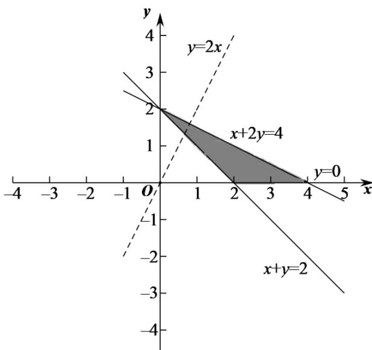

> [!faq]- 精品解析：2022年全国高考乙卷数学（文）试题（解析版）解析
>
> > [!success]- **【答案】** C
>
> > [!note]- **【分析】**
> > 作出可行域，数形结合即可得解.
> > 【
>
> > [!note]- **【解析】**
> > 由题意作出可行域，如图阴影部分所示，
> >
> > 
> >
> > 转化目标函数 $z = 2x - y$ 为 $y = 2x - z$
> >
> > 上下平移直线 $y = 2x - z$ ，可得当直线过点(4,0)时，直线截距最小， $z$ 最大，所以 $z_{\max} = 2 \times 4 - 0 = 8$ .
> >
> > 故选：C.
