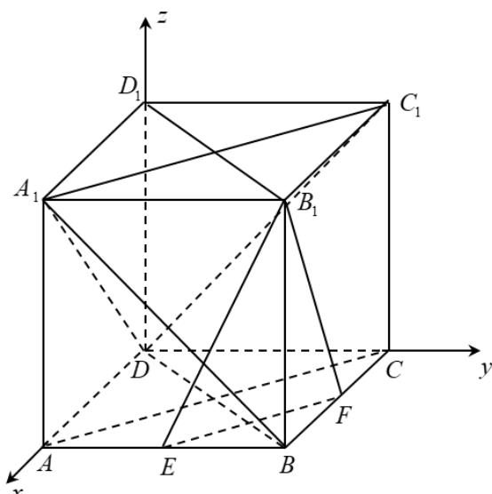

> [!faq]- 精品解析：2022年全国高考乙卷数学（文）试题（解析版）解析
>
> > [!success]- **【答案】** A
>
> > [!note]- **【分析】**
> > 证明 $EF \perp$ 平面 $BDD_{1}$ ，即可判断 A；如图，以点 D 为原点，建立空间直角坐标系，设 AB = 2，分别求出平面 $B_{1}EF$ ， $A_{1}BD$ ， $A_{1}C_{1}D$ 的法向量，根据法向量的位置关系，即可判断 BCD.
>
> > [!note]- **【解析】**
> > 解：在正方体 $ABCD - A_{1}B_{1}C_{1}D_{1}$ 中，
> >
> > $AC \perp BD$ 且 $DD_{1} \perp$ 平面 ABCD，
> >
> > 又 $EF \subset$ 平面ABCD，所以 $EF \perp DD_{1}$ ，
> >
> > 因为 E, F 分别为 AB, BC 的中点，
> >
> > 所以 $EF \parallel AC$ ，所以 $EF \perp BD$ ，
> >
> > 又 $BD \cap DD_{1} = D$ ，
> >
> > 所以 $EF \perp$ 平面 $BDD_{1}$ ,
> >
> > 又 $EF \subset$ 平面 $B_{1}EF$ ，
> >
> > 所以平面 $B_{1}EF \perp$ 平面 $BDD_{1}$ ，故A正确；
> >
> > 如图，以点 D 为原点，建立空间直角坐标系，设 AB = 2，
> >
> > 则 $B_{1}(2,2,2),E(2,1,0),F(1,2,0),B(2,2,0),A_{1}(2,0,2),A(2,0,0),C(0,2,0),$ $C_1(0,2,2)$
> >
> > 则 $EF = (-1,1,0), EB_1 = (0,1,2)$ ， $DB = (2,2,0), D$ $AA_1 = (0,0,2), AC = (-2,2,0), A_1C_1 = (-2,2,0)$ ，设平面 $B_1EF$ 的法向量为 $m = (x_1, y_1, z_1)$ ，则有 $\left\{ \begin{array}{l} \overline{m} \cdot EF = -x_1 + y_1 = 0 \\ \overline{m} \cdot EB_1 = y_1 + 2z_1 = 0 \end{array} \right.$ ，可取 $m = (2,2,-1)$ ，同理可得平面 $A_1BD$ 的法向量为 $n_1 = (1,-1,-1)$ ，平面 $A_1AC$ 的法向量为 $n_2 = (1,1,0)$ ，平面 $A_1C_1D$ 的法向量为 $n_3 = (1,1,-1)$ ，则 $m \cdot n_1 = 2 - 2 + 1 = 1 \neq 0$ ，所以平面 $B_1EF$ 与平面 $A_1BD$ 不垂直，故 B 错误；因为 $m$ 与 $n_2$ 不平行，所以平面 $B_1EF$ 与平面 $A_1AC$ 不平行，故 C 错误；因为 $m$ 与 $n_3$ 不平行，所以平面 $B_1EF$ 与平面 $A_1C_1D$ 不平行，故 D 错误，故选：
> >
> > 故选：A.
> >
> > 
