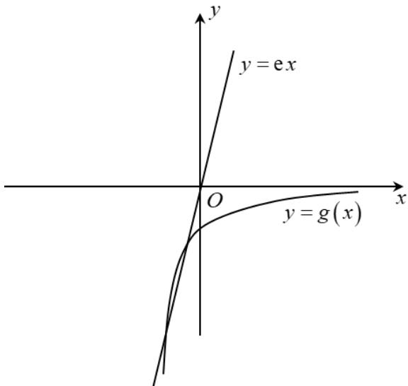

> [!faq]- 精品解析：2022年全国高考乙卷数学（理）试题（解析版）解析
>
> > [!success]- **【答案】** $\left(\frac{1}{e},1\right)$ 【
>
> > [!note]- **【分析】**
> > 由 $x_{1}, x_{2}$ 分别是函数 $f(x) = 2a^{x} - \mathrm{e}x^{2}$ 的极小值点和极大值点，可得 $x \in (-\infty, x_{1}) \cup (x_{2}, +\infty)$ 时， $f'(x) < 0$ ， $x \in (x_{1}, x_{2})$ 时， $f'(x) > 0$ ，再分 $a > 1$ 和 $0 < a < 1$ 两种情况讨论，方程 $2\ln a \cdot a^{x} - 2\mathrm{e}x = 0$ 的两个根为 $x_{1}, x_{2}$ ，即函数 $y = \ln a \cdot a^{x}$ 函数 $y = \mathrm{e}x$ 的图象有两个不同的交点，构造函数 $g(x) = \ln a \cdot a^x$ ，根据导数的结合意义结合图象即可得出
>
> > [!note]- **【解析】**
> > 解： $f'(x)=2\ln a\cdot a^{x}-2ex$
> >
> > 因为 $x_{1}, x_{2}$ 分别是函数 $f(x) = 2a^{x} - \mathrm{e}x^{2}$ 的极小值点和极大值点，
> >
> > 所以函数 $f(x)$ 在 $(- \infty, x_1)$ 和 $(x_2, +\infty)$ 上递减，在 $(x_1, x_2)$ 上递增，
> >
> > 所以当 $x \in (-\infty, x_1) \cup (x_2, +\infty)$ 时， $f'(x) < 0$ ，当 $x \in (x_1, x_2)$ 时， $f'(x) > 0$
> >
> > 若 $a > 1$ 时，
> >
> > 当 $x < 0$ 时， $2\ln a \cdot a^x > 0, 2\mathrm{e}x < 0$
> >
> > 则此时 $f^{\prime}(x) > 0$ ，与前面矛盾，
> >
> > 故 $a > 1$ 不符合题意，
> >
> > 若 $0 < a < 1$ 时，
> >
> > 则方程 $2\ln a \cdot a^{x} - 2ex = 0$ 的两个根为 $x_{1}, x_{2}$ ，
> >
> > 即方程 $\ln a\cdot a^{x} = \mathrm{e}x$ 的两个根为 $x_{1},x_{2}$
> >
> > 即函数 $y = \ln a \cdot a^{x}$ 与函数 $y = e x$ 的图象有两个不同的交点，
> >
> > 令 $g(x) = \ln a\cdot a^x$ ，则 $g^{\prime}(x) = \ln^{2}a\cdot a^{x},0 <   a <   1,$
> >
> > 设过原点且与函数 $y = g(x)$ 的图象相切的直线的切点为 $\left(x_0, \ln a \cdot a^{x_0}\right)$ ，
> >
> > 则切线的斜率为 $g'(x_{0})=\ln^{2}a\cdot a^{x_{0}}$
> >
> > 故切线方程为 $y - \ln a \cdot a^{x_{0}} = \ln^{2} a \cdot a^{x_{0}} (x - x_{0})$ ,
> >
> > 则有 $-\ln a \cdot a^{x_{0}} = -x_{0} \ln^{2} a \cdot a^{x_{0}}$ ,
> >
> > 解得 $x_0 = \frac{1}{\ln a}$
> >
> > 则切线的斜率为 $\ln^{2}a\cdot a^{\frac{1}{\ln a}}=e\ln^{2}a$
> >
> > 因为函数 $y = \ln a \cdot a^{x}$ 与函数 y = e x 的图象有两个不同的交点，
> >
> > 所以 $e \ln^{2} a < e$ ，解得 $\frac{1}{e} < a < e$ ，
> >
> > 又 $_{0<a<1}$ ，所以 $\frac{1}{e}<a<1$ ，
> >
> > 综上所述， $a$ 的范围为 $\left(\frac{1}{\mathrm{e}}, 1\right)$ .
> >
> > 
> >
> > 【点睛】本题考查了函数的极值点问题，考查了导数的几何意义，考查了转化思想及分类讨论思想，有一定的难度.
