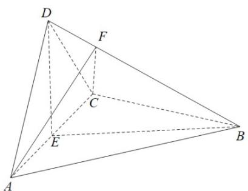

<!-- question-source:start -->
18. 如图，四面体 $ABCD$ 中， $AD \perp CD, AD = CD, \angle ADB = \angle BDC$ ， $E$ 为 $AC$ 的中点.

(1) 证明: 平面 $BED \perp$ 平面 $ACD$ ;
<!-- question-source:end -->

![[高中/真题/按年份分类/2022/精品解析_2022年全国高考乙卷数学_理_试题_解析版_/解答题/题目/answers/Q00031208A1.md]]
