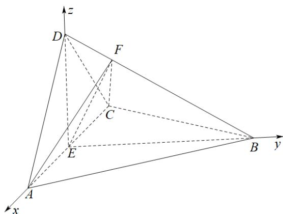

> [!faq]- 精品解析：2022年全国高考乙卷数学（理）试题（解析版）解析
>
> > [!success]- **【答案】** （1）证明过程见
>
> > [!note]- **【分析】**
> > （1）根据已知关系证明 $\triangle ABD \cong \triangle CBD$ ，得到 $AB = CB$ ，结合等腰三角形三线合一得到垂直关系，结合面面垂直的判定定理即可证明；
>
> > [!note]- **【解析】**
> > 因为 $AD = CD$ ， $E$ 为 $AC$ 的中点，所以 $AC \perp DE$ ；
> >
> > 在 $\triangle ABD$ 和 $\triangle CBD$ 中，因为 $AD = CD, \angle ADB = \angle CDB, DB = DB$
> >
> > 所以 $\triangle ABD \cong \triangle CBD$ ，所以 $AB = CB$ ，又因为 $E$ 为 $AC$ 的中点，所以 $AC \perp BE$ ；
> >
> > 又因为 $DE, BE \subset$ 平面 $BED$ ， $DE \cap BE = E$ ，所以 $AC \perp$ 平面 $BED$ ，
> >
> > 因为 $AC \subset$ 平面 ACD，所以平面 BED ⊥ 平面 ACD。
> >
> > 【
> >
> > 小问 2
> >
> > 连接 EF，由（1）知， $AC \perp$ 平面 BED，因为 $EF \subset$ 平面 BED，
> >
> > 所以 $AC \perp EF$ ，所以 $S_{\triangle AFC} = \frac{1}{2} AC \cdot EF$ ，
> >
> > 当 $EF \perp BD$ 时， $EF$ 最小，即 $\triangle AFC$ 的面积最小.
> >
> > 因为 $\triangle ABD \cong \triangle CBD$ ，所以 $CB = AB = 2$ ，
> >
> > 又因为 $\angle ACB = 60^{\circ}$ ，所以 $\triangle ABC$ 是等边三角形，
> >
> > 因为 $E$ 为 $AC$ 的中点，所以 $AE = EC = 1$ ， $BE = \sqrt{3}$
> >
> > 因为 $AD \perp CD$ ，所以 $DE = \frac{1}{2} AC = 1$ ，
> >
> > 在 $\triangle DEB$ 中， $DE^{2} + BE^{2} = BD^{2}$ ，所以 $BE\perp DE$ ：
> >
> > 以 E 为坐标原点建立如图所示的空间直角坐标系 E - xyz，
> >
> > 则 $A(1,0,0),B(0,\sqrt{3},0),D(0,0,1)$ ，所以 $AD = (-1,0,1),AB = (-1,\sqrt{3},0)$
> >
> > 设平面 $ABD$ 的一个法向量为 $n = (x, y, z)$ ,
> >
> > 则 $\left\{ \begin{array}{l} \overline{n} \cdot AD = -x + z = 0 \\ \overline{n} \cdot AB = -x + \sqrt{3}y = 0 \end{array} \right.$ ，取 $y = \sqrt{3}$ ，则 $n = (3, \sqrt{3}, 3)$ ，
> >
> > 又因为 $C(-1,0,0), F\left(0, \frac{\sqrt{3}}{4}, \frac{3}{4}\right)$ ，所以 $CF = \left(1, \frac{\sqrt{3}}{4}, \frac{3}{4}\right)$ ，
> >
> > 所以 $\cos\left\langle n,CF\right\rangle=\frac{n:CF}{\left|n\right|\left|CF\right|}=\frac{6}{\sqrt{21}\times\sqrt{\frac{7}{4}}}=\frac{4\sqrt{3}}{7}$
> >
> > 设 $_{CF}$ 与平面 $_{ABD}$ 所成的角的正弦值为 $\theta\left(0\leq\theta\leq\frac{\pi}{2}\right)$ ,
> >
> > 所以 $\sin \theta = |\cos \langle n, CF\rangle| = \frac{4\sqrt{3}}{7}$
> >
> > 所以 $CF$ 与平面 $ABD$ 所成的角的正弦值为 $\frac{4\sqrt{3}}{7}$ .
> >
> > 
