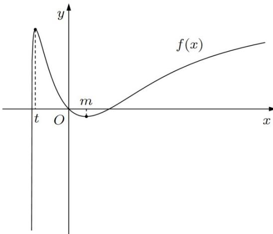

> [!faq]- 精品解析：2022年全国高考乙卷数学（理）试题（解析版）解析
>
> > [!success]- **【答案】** (1) $y = 2x$ (2) $(- \infty, -1)$ 【
>
> > [!note]- **【分析】**
> > （1）先算出切点,再求导算出斜率即可
>
> > [!note]- **【解析】**
> > $f(x)$ 的定义域为 $(-1, +\infty)$
> >
> > 当 $a = 1$ 时， $f(x) = \ln (1 + x) + \frac{x}{\mathrm{e}^x}$ ， $f(0) = 0$ ，所以切点为 $(0,0)$
> >
> > $f^{\prime}(x) = \frac{1}{1 + x} +\frac{1 - x}{\mathrm{e}^{x}},f^{\prime}(0) = 2$ ，所以切线斜率为2
> >
> > 所以曲线 $y = f(x)$ 在点 $(0, f(0))$ 处的切线方程为 $y = 2x$
> >
> > 【
> >
> > 小问 2
> >
> > $$
> > f (x) = \ln (1 + x) + \frac {a x}{\mathrm{e} ^ {x}}
> > $$
> >
> > $$
> > f ^ {\prime} (x) = \frac {1}{1 + x} + \frac {a (1 - x)}{\mathrm{e} ^ {x}} = \frac {\mathrm{e} ^ {x} + a (1 - x ^ {2})}{(1 + x) \mathrm{e} ^ {x}}
> > $$
> >
> > 设 $g(x) = \mathrm{e}^{x} + a(1 - x^{2})$
> >
> > $1^{\circ}$ 若 $a > 0$ ，当 $x \in (-1,0), g(x) = \mathrm{e}^{x} + a(1 - x^{2}) > 0$ 即 $f'(x) > 0$
> >
> > 所以 $f(x)$ 在 $(-1,0)$ 上单调递增， $f(x) < f(0) = 0$
> >
> > 故 $f(x)$ 在 $(-1,0)$ 上没有零点，不合题意
> >
> > $2^{\circ}$ 若 $-1, a, 0$ ，当 $x \in (0, +\infty)$ ，则 $g'(x) = e^{x} - 2ax > 0$
> >
> > 所以 $g(x)$ 在 $(0, +\infty)$ 上单调递增所以 $g(x) > g(0) = 1 + a...0$ ，即 $f'(x) > 0$
> >
> > 所以 $f(x)$ 在 $(0, +\infty)$ 上单调递增， $f(x) > f(0) = 0$
> >
> > 故 $f(x)$ 在 $(0, +\infty)$ 上没有零点, 不合题意
> >
> > $3^{\circ}$ 若 a < -1
> >
> > (1)当 $x\in (0, + \infty)$ ，则 $g^{\prime}(x) = \mathrm{e}^{x} - 2ax > 0$ ，所以 $g(x)$ 在 $(0, + \infty)$ 上单调递增
> >
> > $$
> > g (0) = 1 + a <   0, g (1) = \mathrm{e} > 0
> > $$
> >
> > 所以存在 $m \in (0,1)$ , 使得 $g(m) = 0$ , 即 $f'(m) = 0$
> >
> > 当 $x \in (0, m)$ , $f'(x) < 0$ , $f(x)$ 单调递减
> >
> > 当 $x \in (m, +\infty)$ , $f'(x) > 0$ , $f(x)$ 单调递增
> >
> > 所以
> >
> > 当 $x\in (0,m),f(x) <   f(0) = 0$
> >
> > 当 $x \to +\infty, f(x) \to +\infty$
> >
> > 所以 $f(x)$ 在 $(m, +\infty)$ 上有唯一零点
> >
> > 又 $(0,m)$ 没有零点,即 $f(x)$ 在 $(0, +\infty)$ 上有唯一零点
> >
> > (2)当 $x \in (-1, 0), g(x) = \mathrm{e}^{x} + a(1 - x^{2})$
> >
> > 设 $h(x)=g'(x)=\mathrm{e}^{x}-2ax$
> >
> > $$
> > h ^ {\prime} (x) = \mathrm{e} ^ {x} - 2 a > 0
> > $$
> >
> > 所以 $g'(x)$ 在 $(-1,0)$ 单调递增
> >
> > $$
> > g ^ {\prime} (- 1) = \frac {1}{\mathrm{e}} + 2 a <   0, g ^ {\prime} (0) = 1 > 0
> > $$
> >
> > 所以存在 $n \in (-1,0)$ , 使得 $g'(n) = 0$
> >
> > 当 $x \in (-1, n), g'(x) < 0, g(x)$ 单调递减
> >
> > 当 $x \in (n,0), g'(x) > 0, g(x)$ 单调递增 $g(x) < g(0) = 1 + a < 0$
> >
> > 又 $g(-1) = \frac{1}{\mathrm{e}} >0$
> >
> > 所以存在 $t\in(-1,n)$ ，使得 $g(t)=0$ ，即 $f'(t)=0$
> >
> > 当 $x \in (-1, t)$ , $f(x)$ 单调递增, 当 $x \in (t, 0)$ , $f(x)$ 单调递减
> >
> > 有 $x \to -1, f(x) \to -\infty$
> >
> > 而 $f(0) = 0$ ，所以当 $x\in (t,0),f(x) > 0$
> >
> > 所以 $f(x)$ 在 $(-1,t)$ 上有唯一零点， $(t,0)$ 上无零点
> >
> > 即 $f(x)$ 在 $(-1,0)$ 上有唯一零点
> >
> > 所以 a < -1, 符合题意
> >
> > 所以若 $f(x)$ 在区间 $(-1,0),(0, + \infty)$ 各恰有一个零点，求 $a$ 的取值范围为 $(-\infty , - 1)$
> >
> > 
> >
> > 【点睛】方法点睛：本题的关键是对 $a$ 的范围进行合理分类，否定和肯定并用，否定只需要说明一边不满足即可，肯定要两方面都说明.
> >
> > （二）选考题，共10分．请考生在第22、23题中任选一题作答．如果多做，则按所做的第一题计分.
> >
> > [选修 4-4：坐标系与参数方程]
